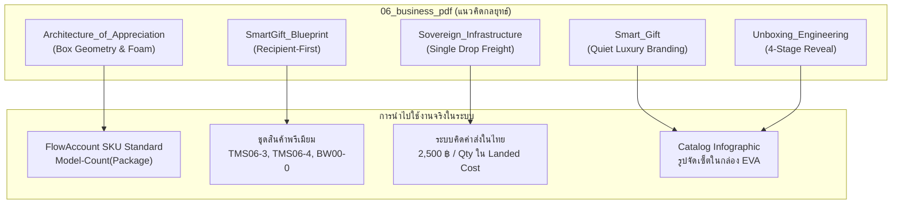

# 📘 สเปกและทะเบียนเอกสารกลยุทธ์ธุรกิจ: `06_business_pdf`

- **ที่ตั้งโฟลเดอร์:** `data-pipeline/01_raw/06_business_pdf/`
- **สถานะ:** 🔒 ข้อมูลกลยุทธ์ภายใน (Confidential / Strategy Blueprints)
- **จำนวนเอกสาร:** 5 เล่ม (62 หน้า รวม 60,281,929 ไบต์)
- **สัดส่วนหน้ากระดาษ:** 16:9 แนวนอน (1376 × 768 px / 485.42 × 270.93 มม.)
- **นโยบายความปลอดภัย:** Zero-PII (ไม่เปิดเผยข้อมูลส่วนบุคคล) & Anti-Hyperbole Claim Governance

---

## 🗺️ 1. สรุปภาพรวมเอกสารกลยุทธ์ทั้ง 5 เล่ม

| ลำดับ | ชื่อไฟล์เอกสาร | หน้า | บทบาทหลัก | ปรัชญาและแนวคิดที่นำมาใช้ |
| :---: | :--- | :---: | :--- | :--- |
| **1** | **`Architecture_of_Appreciation.pdf`** | 6 | สถาปัตยกรรมกล่องและแพ็กเกจ | • 4 ระดับการแสดงความขอบคุณ (Tiers of Care) • โครงสร้างกล่องพรีเมียม P-Series (P-01 ถึง P-16) • บล็อกโฟม EVA หล่อเข้ารูปและผ้ากำมะหยี่ |
| **2** | **`SmartGift_2026_Portfolio_Blueprint.pdf`** | 12 | พิมพ์เขียวพอร์ตโฟลิโอสินค้า | • ปรัชญา **Recipient-First** (คิดจากผู้รับเป็นที่ตั้ง) • การแบ่งหมวดตามไลฟ์สไตล์ (5-9 ธีม) • กฎควบคุมคำกล่าวอ้างสเปกสินค้า (Claim Governance) |
| **3** | **`Smart_Gift.pdf`** | 15 | วิสัยทัศน์และการวางตำแหน่ง | • แบรนด์ B2B Corporate Gift Positioning • นิยาม Tier เป็นระดับการดูแล ไม่จำกัดด้วยตำแหน่ง • มาตรฐานการสกรีนโลโก้และฟอยล์ปั๊มทอง/เงิน |
| **4** | **`Sovereign_Group_Digital_Infrastructure.pdf`** | 14 | โครงสร้างพื้นฐานและโลจิสติกส์ | • โมเดลขนส่ง **Direct Single Drop** (2,500 บาท/เที่ยว) • การคิดเฉลี่ยค่าขนส่งใน Landed Cost (Free Delivery) • ระบบเชื่อมโยง FlowAccount ERP และความลับข้อมูล |
| **5** | **`Unboxing_Engineering.pdf`** | 15 | วิศวกรรมประสบการณ์ Unboxing | • **4-Stage Reveal Hierarchy** (จังหวะเปิดกล่อง 4 ชั้น) • สุนทรียศาสตร์แบบ **Quiet Luxury** (หรูหรา เรียบง่าย) • ผิวสัมผัสแบบ Sensory Touch & ความแข็งแกร่งโครงสร้าง |

---

## 🔍 2. รายละเอียดเจาะลึกแต่ละเล่ม (Deep-dive Blueprint Analysis)

### 2.1 `Architecture_of_Appreciation.pdf` (6 หน้า)
* **SHA-256:** `0c306630490f7e0d43df529d7a6e93f08e8f619a97d6e29e8f9ef950c8dd92e1`
* **หน้าที่หลัก:** กำหนดสถาปัตยกรรมกายภาพของกล่องของขวัญ
* **แนวคิดที่นำมาใช้:**
  1. **Tiers of Care (4 ระดับ):** ออกแบบแพ็กเกจให้สะท้อนน้ำหนักความสำคัญของความสัมพันธ์ (Executive, VIP Partner, Management, Staff)
  2. **Box Form Factors:** ที่มาของรหัสแพ็กเกจใน FlowAccount เช่น `P-06` (กล่องเซ็ต 3 ชิ้นสำหรับ TMS06-3), `P-16` (กล่องเซ็ต 4 ชิ้นสำหรับ TMS06-4), และ `P-BAG` (ถุงของขวัญหูหิ้วสำหรับ BW00-0)
  3. **Interior Precision:** การใช้โฟม EVA ความหนาแน่นสูง เจาะช่องตามรูปทรงสินค้ามิลลิเมตรต่อมิลลิเมตร เพื่อไม่ให้สินค้าเลื่อนหลุดระหว่างการขนส่ง

### 2.2 `SmartGift_2026_Portfolio_Blueprint.pdf` (12 หน้า)
* **SHA-256:** `c9ee13ceac99a755d36a25ebf64ae162bfd8ccde4bc7bb6333840bf392f3a35e`
* **หน้าที่หลัก:** แผนแม่บทการจัดพอร์ตสินค้าและธีมการนำเสนอ
* **แนวคิดที่นำมาใช้:**
  1. **Recipient-First Philosophy:** จุดเริ่มต้นของการเลือกสินค้าต้องตอบโจทย์ผู้รับ (เช่น ใช้แก้วเก็บความเย็นที่ทำงานได้จริง, พาวเวอร์แบงค์ที่มีขาตั้งดูคลิปได้, ร่มเปิดปิดออโต้กัน UV)
  2. **Strategic Claim Governance:** กฎเหล็กในการจัดทำแคตตาล็อก ต้องไม่นำสเปกเกินจริงที่โรงงานไม่ได้รับรองมากล่าวอ้าง (เช่น ไม่เคลมเกรดการแพทย์ หรือ Military-grade โดยไม่มีหลักฐาน)

### 2.3 `Smart_Gift.pdf` (15 หน้า)
* **SHA-256:** `4f3a5c01a7a50c73a0a77d444ec3bbb393c35119229743efe8c984a0c4d36521`
* **หน้าที่หลัก:** การวางตำแหน่งทางการตลาด (Brand Positioning) และการสร้างคุณค่า
* **แนวคิดที่นำมาใช้:**
  1. **Quiet Luxury Corporate Gift:** สินค้าของขวัญต้องเสริมสร้างภาพลักษณ์ที่ดีให้แก่องค์กรผู้มอบ และเป็นของที่ผู้รับภูมิใจที่จะนำมาวางบนโต๊ะทำงาน
  2. **Care Tiers Over Title:** ส่งเสริมให้องค์กรส่งมอบของขวัญตามความผูกพัน ไม่ใช่จำกัดสเปกของตามตำแหน่งงานเพียงอย่างเดียว
  3. **Branding Customization:** โลโก้ขององค์กรต้องอยู่ในตำแหน่งที่พอดีตา ไม่ใหญ่เทอะทะจนกลบดีไซน์ของสินค้า

### 2.4 `Sovereign_Group_Digital_Infrastructure.pdf` (14 หน้า)
* **SHA-256:** `d6fdb811f0a407d12753312005ae322211546532af7248df1dc7afb4d2e42b1a`
* **หน้าที่หลัก:** โครงสร้างระบบดิจิทัลและการจัดการข้อมูลต้นทุน
* **แนวคิดที่นำมาใช้:**
  1. **Direct Single Drop Model:** การบริหารต้นทุนค่ารถขนส่งในไทยแบบเหมาเที่ยว (2,500 บาท) จากท่าเรือตรงไปยังโกดังลูกค้าจุดเดียว แล้วหารเฉลี่ยเป็นต้นทุนแฝง (Absorbed Freight) เพื่อให้เสนอราคาแบบส่งฟรีได้
  2. **Data Privacy & Zero-PII:** การรักษาความลับข้อมูลลูกค้าองค์กร ประวัติราคา และห้ามนำข้อมูลบุคคลจริงมาใส่ในแคตตาล็อกสาธารณะ

### 2.5 `Unboxing_Engineering.pdf` (15 หน้า)
* **SHA-256:** `1b50882c90cfd005cac2a1423fc9d62bcd4538dae133aca784315e813b10c69a`
* **หน้าที่หลัก:** วิศวกรรมประสบการณ์เปิดกล่อง 4 ลำดับ
* **แนวคิดที่นำมาใช้:**
  - **Stage 1 (First Glance):** ปลอกสวมกล่อง (Sleeve) หรือถุงของขวัญสี Dark Blue ให้ความรู้สึกน่าค้นหา
  - **Stage 2 (The Box):** ตัวกล่องแข็งจั่วปังพรีเมียม สัมผัสความแน่นและเสียงลมค่อยๆ คลายตัวตอนยกฝาเปิด
  - **Stage 3 (The Greeting):** การ์ดขอบคุณหรือกระดาษไขพิมพ์ลายปิดผนึก เพิ่มช่วงเวลาแห่งความตื่นเต้น
  - **Stage 4 (Product Reveal):** สินค้าทุกชิ้นนอนนิ่งในบล็อกโฟม EVA ดำเนียน สกรีนโลโก้องค์กรอย่างประณีต

---

## 🔗 3. ความเชื่อมโยงกับโมเดลราคาและ FlowAccount

---

## 📂 4. ทะเบียนไฟล์ที่เกี่ยวข้อง

* **JSON Registry:** [docs/specs/business_pdf_blueprints_registry.json](file:///c:/Users/pc/workspace/business-01-smart-gift/docs/specs/business_pdf_blueprints_registry.json)
* **Data Pipeline Intake:** [data-pipeline/01_raw/06_business_pdf/](file:///c:/Users/pc/workspace/business-01-smart-gift/data-pipeline/01_raw/06_business_pdf)
* **Prepared Dataset:** [data-pipeline/02_prepared/business_pdf_blueprints.json](file:///c:/Users/pc/workspace/business-01-smart-gift/data-pipeline/02_prepared/business_pdf_blueprints.json)
