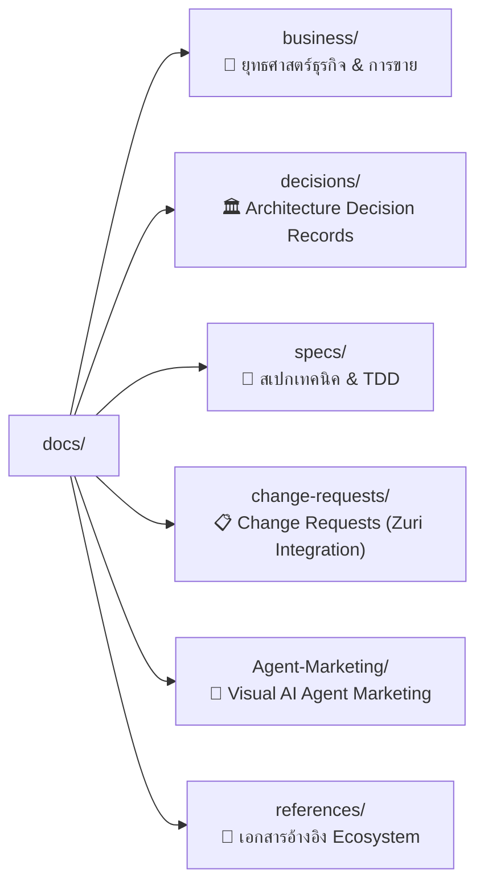

# 📚 SmartGift B2B Documentation Master Index

> **ขอบเขต:** สารบัญรวมและดัชนีนำทางเอกสารทั้งหมดในไดเรกทอรี [`docs/`](file:///C:/Users/pc/workspace/Org-01/docs) สำหรับ **Business 01: SmartGift**

---

## 🗂️ หมวดหมู่เอกสารหลัก (Documentation Categories)

---

## 1. 🏢 ยุทธศาสตร์ธุรกิจและการขาย ([`docs/business/`](file:///C:/Users/pc/workspace/Org-01/docs/business))
*👉 ดูสารบัญฉบับเต็มได้ที่ [**`docs/business/INDEX.md`**](file:///C:/Users/pc/workspace/Org-01/docs/business/INDEX.md)*

- [**`SMARTGIFT-BRAND-PRODUCT-PORTFOLIO-ARCHITECTURE-2026-08.md`**](file:///C:/Users/pc/workspace/Org-01/docs/business/SMARTGIFT-BRAND-PRODUCT-PORTFOLIO-ARCHITECTURE-2026-08.md) (`SG-BPPA-001`): สถาปัตยกรรมแบรนด์และพอร์ตโฟลิโอ 4 ระดับ (`Reach`, `Select`, `Signature`, `Bespoke`)
- [**`SMARTGIFT-PORTFOLIO-EXECUTIVE-DECISION-DECK-2026-08.md`**](file:///C:/Users/pc/workspace/Org-01/docs/business/SMARTGIFT-PORTFOLIO-EXECUTIVE-DECISION-DECK-2026-08.md) (`SG-EDP-001`): บทสรุปสไลด์สำหรับนำเสนอผู้บริหาร
- [**`SMARTGIFT-GO-TO-MARKET-PLAN-2026-08.md`**](file:///C:/Users/pc/workspace/Org-01/docs/business/SMARTGIFT-GO-TO-MARKET-PLAN-2026-08.md) (`SG-GTM-001`): แผนกลยุทธ์การเข้าสู่ตลาดสำหรับ Controlled Pilot 90 วัน
- [**`SMARTGIFT-PRODUCT-TAXONOMY-OFFER-RULES-2026-08.md`**](file:///C:/Users/pc/workspace/Org-01/docs/business/SMARTGIFT-PRODUCT-TAXONOMY-OFFER-RULES-2026-08.md) (`SG-PTOR-001`): กฎการจัดหมวดหมู่สินค้าและเงื่อนไขการประกอบชุดของขวัญ
- [**`SMARTGIFT-SALES-PLAYBOOK-2026-08.md`**](file:///C:/Users/pc/workspace/Org-01/docs/business/SMARTGIFT-SALES-PLAYBOOK-2026-08.md) (`SG-SPB-001`): คู่มือการขาย บทสนทนา และการตอบข้อโต้แย้งสำหรับฝ่ายขาย
- [**`SMARTGIFT-CAMPAIGN-BRIEF-RECIPIENT-MATRIX-TEMPLATE-2026-08.md`**](file:///C:/Users/pc/workspace/Org-01/docs/business/SMARTGIFT-CAMPAIGN-BRIEF-RECIPIENT-MATRIX-TEMPLATE-2026-08.md) (`SG-CBRM-001`): แม่แบบวิเคราะห์กลุ่มผู้รับและบรีฟแคมเปญ
- [**`SMARTGIFT_SYSTEM_ARCHITECTURE.md`**](file:///C:/Users/pc/workspace/Org-01/docs/business/SMARTGIFT_SYSTEM_ARCHITECTURE.md): พิมพ์เขียวสถาปัตยกรรมระบบ B2B และ Data Pipeline v2.0.0

---

## 2. 🏛️ บันทึกการตัดสินใจเชิงสถาปัตยกรรม ([`docs/decisions/`](file:///C:/Users/pc/workspace/Org-01/docs/decisions))

- [**`ADR-001-ECO-FRIENDLY-CATEGORY-REFACTOR.md`**](file:///C:/Users/pc/workspace/Org-01/docs/decisions/ADR-001-ECO-FRIENDLY-CATEGORY-REFACTOR.md): การปรับโครงสร้างหมวดหมู่สินค้าเป็นมิตรกับสิ่งแวดล้อม
- [**`ADR-002-PRICELIST-MASTER-SQL-SNAPSHOT.md`**](file:///C:/Users/pc/workspace/Org-01/docs/decisions/ADR-002-PRICELIST-MASTER-SQL-SNAPSHOT.md): การใช้ FlowAccount SQL Snapshot เป็นแหล่งความจริงด้านราคา
- [**`ADR-003-SEASONAL-PKG-SCHEMA-PROFIT-GATE.md`**](file:///C:/Users/pc/workspace/Org-01/docs/decisions/ADR-003-SEASONAL-PKG-SCHEMA-PROFIT-GATE.md): การกำหนดเกณฑ์กำไรขั้นต่ำ (Profit Gate) สำหรับชุด Seasonal Package
- [**`ADR-004-CUSTOMER-SAFE-PRICELIST-ENDPOINT.md`**](file:///C:/Users/pc/workspace/Org-01/docs/decisions/ADR-004-CUSTOMER-SAFE-PRICELIST-ENDPOINT.md): การแยก Endpoint แสดงราคาที่ปลอดภัยสำหรับลูกค้า (Zero-PII & No Margin Leak)
- [**`ADR-005-FACTORY-COST-INTAKE-LANE.md`**](file:///C:/Users/pc/workspace/Org-01/docs/decisions/ADR-005-FACTORY-COST-INTAKE-LANE.md): ช่องทางนำเข้าและสกัดข้อมูลต้นทุนโรงงาน
- [**`ADR-006-PRIVATE-REPOSITORY-SOURCE-DATA-EXCEPTION.md`**](file:///C:/Users/pc/workspace/Org-01/docs/decisions/ADR-006-PRIVATE-REPOSITORY-SOURCE-DATA-EXCEPTION.md): ข้อยกเว้นการจัดเก็บข้อมูลต้นฉบับเฉพาะใน Private Repository
- [**`ADR-007-KNOWLEDGE-REGISTRY-AND-PROVENANCE.md`**](file:///C:/Users/pc/workspace/Org-01/docs/decisions/ADR-007-KNOWLEDGE-REGISTRY-AND-PROVENANCE.md): ระบบติดตามที่มาและการตรวจสอบย้อนกลับของชุดข้อมูล (Data Provenance)
- [**`ADR-008-PRODUCT-3D-ASSET-PIPELINE.md`**](file:///C:/Users/pc/workspace/Org-01/docs/decisions/ADR-008-PRODUCT-3D-ASSET-PIPELINE.md): ไปป์ไลน์ประมวลผลไฟล์โมเดลสามมิติ 3D Assets (.glb)

---

## 3. 📐 สเปกทางเทคนิคและการทดสอบ ([`docs/specs/`](file:///C:/Users/pc/workspace/Org-01/docs/specs))

- [**`SPEC-CUSTOMER-CATALOG-IMAGE-FIRST-2026-08-30.md`**](file:///C:/Users/pc/workspace/Org-01/docs/specs/SPEC-CUSTOMER-CATALOG-IMAGE-FIRST-2026-08-30.md): สเปกการแสดงผลแคตตาล็อกแบบรูปภาพนำ (Image-First)
- [**`SPEC-PRODUCT-3D-VIEWER-2026-08-31.md`**](file:///C:/Users/pc/workspace/Org-01/docs/specs/SPEC-PRODUCT-3D-VIEWER-2026-08-31.md): สเปก 3D Viewer & Three.js Interaction
- [**`SPEC-PRODUCT-3D-ASSETS-2026-08-31.md`**](file:///C:/Users/pc/workspace/Org-01/docs/specs/SPEC-PRODUCT-3D-ASSETS-2026-08-31.md): สเปกโครงสร้างและการจัดเก็บไฟล์ 3D Assets
- [**`SPEC-KNOWLEDGE-REGISTRY-2026-08-31.md`**](file:///C:/Users/pc/workspace/Org-01/docs/specs/SPEC-KNOWLEDGE-REGISTRY-2026-08-31.md): สเปกระบบ Knowledge Registry & Provenance
- [**`SPEC-PRICELIST-SALE-COST-CBM-COMPARISON-2026-08-30.md`**](file:///C:/Users/pc/workspace/Org-01/docs/specs/SPEC-PRICELIST-SALE-COST-CBM-COMPARISON-2026-08-30.md): สเปกการคำนวณและเปรียบเทียบต้นทุน/ราคา/ปริมาตร (CBM)
- [**`SPEC-SMARTGIFT-LANDSCAPE-CATALOG-2026-08-30.md`**](file:///C:/Users/pc/workspace/Org-01/docs/specs/SPEC-SMARTGIFT-LANDSCAPE-CATALOG-2026-08-30.md): สเปกแคตตาล็อกมุมมองแนวนอน
- [**`SPEC-WEB-OFFLINE-CATALOG-INTERACTION-2026-08-30.md`**](file:///C:/Users/pc/workspace/Org-01/docs/specs/SPEC-WEB-OFFLINE-CATALOG-INTERACTION-2026-08-30.md): สเปกการทำงานของแคตตาล็อกแบบออฟไลน์
- [**`TDD-SEASONAL-PKG-PROFIT-GATE-EXPO-2026-08-30.md`**](file:///C:/Users/pc/workspace/Org-01/docs/specs/TDD-SEASONAL-PKG-PROFIT-GATE-EXPO-2026-08-30.md): Technical Design & Test Plan สำหรับ Seasonal Package Profit Gate
- [**`ERD-SMARTGIFT-GENESISBLOCK.md`**](file:///C:/Users/pc/workspace/Org-01/docs/specs/ERD-SMARTGIFT-GENESISBLOCK.md): แผนภาพความสัมพันธ์ของเอนทิตี (Entity Relationship Diagram)

---

## 4. 📋 ข้อเสนอการเปลี่ยนแปลงสำหรับระบบหลัก ([`docs/change-requests/`](file:///C:/Users/pc/workspace/Org-01/docs/change-requests))

- [**`CR-002-GKS-MSP-CATALOG-VAULT-RESOLUTION.md`**](file:///C:/Users/pc/workspace/Org-01/docs/change-requests/CR-002-GKS-MSP-CATALOG-VAULT-RESOLUTION.md): การผูก Scope Chain เข้ากับ Vault Resolution
- [**`CR-003-DATA-PIPELINE-GOVERNANCE-AND-APPROVAL-GATES.md`**](file:///C:/Users/pc/workspace/Org-01/docs/change-requests/CR-003-DATA-PIPELINE-GOVERNANCE-AND-APPROVAL-GATES.md): แดชบอร์ดควบคุมธรรมาภิบาลและการอนุมัติข้อมูล
- [**`CR-004-GITHUB-INTEGRATION-AND-FILES-TAB-EXPLORER.md`**](file:///C:/Users/pc/workspace/Org-01/docs/change-requests/CR-004-GITHUB-INTEGRATION-AND-FILES-TAB-EXPLORER.md): การเชื่อมต่อ GitHub File Tree Explorer
- [**`CR-005-SHIPPING-RATE-MATRIX-AND-OMNICHANNEL-AGENT-CONNECTORS.md`**](file:///C:/Users/pc/workspace/Org-01/docs/change-requests/CR-005-SHIPPING-RATE-MATRIX-AND-OMNICHANNEL-AGENT-CONNECTORS.md): การตั้งค่าตารางค่าขนส่งและการเชื่อมต่อ LINE OA
- [**`CR-006-PII-IN-VERSION-CONTROL-AND-ZURI-FILE-INTAKE-READINESS.md`**](file:///C:/Users/pc/workspace/Org-01/docs/change-requests/CR-006-PII-IN-VERSION-CONTROL-AND-ZURI-FILE-INTAKE-READINESS.md): การควบคุมข้อมูล PII และความพร้อมของระบบ Intake

---

## 5. 🤖 Visual AI Agent Marketing Team ([`docs/Agent-Marketing/`](file:///C:/Users/pc/workspace/Org-01/docs/Agent-Marketing))

- [**`PRD-Visual-AI-Agent-Marketing-Team.md`**](file:///C:/Users/pc/workspace/Org-01/docs/Agent-Marketing/PRD-Visual-AI-Agent-Marketing-Team.md): Product Requirements Document
- [**`SRS-Visual-AI-Agent-Marketing-Team.md`**](file:///C:/Users/pc/workspace/Org-01/docs/Agent-Marketing/SRS-Visual-AI-Agent-Marketing-Team.md): Software Requirements Specification
- [**`SPEC-Visual-AI-Agent-Marketing-Team.md`**](file:///C:/Users/pc/workspace/Org-01/docs/Agent-Marketing/SPEC-Visual-AI-Agent-Marketing-Team.md): Architecture & Technical Specification
- [**`TDD-Visual-AI-Agent-Marketing-Team.md`**](file:///C:/Users/pc/workspace/Org-01/docs/Agent-Marketing/TDD-Visual-AI-Agent-Marketing-Team.md): Technical Design & Test Plan
- [**`REQ-CR-012-visual-office-mvp.md`**](file:///C:/Users/pc/workspace/Org-01/docs/Agent-Marketing/REQ-CR-012-visual-office-mvp.md): Change Request สำหรับ Visual Office MVP

---

## 6. 📑 เอกสารอ้างอิง Ecosystem ภาพรวม

- [**`DATA_PIPELINE_AND_VAULT_STRUCTURE.md`**](file:///C:/Users/pc/workspace/Org-01/docs/DATA_PIPELINE_AND_VAULT_STRUCTURE.md): สเปกโครงสร้าง Data Pipeline 5 ขั้นตอนและการจัดเก็บใน Vaults
- [**`ZURI_ECOSYSTEM_BOUNDARIES.md`**](file:///C:/Users/pc/workspace/Org-01/docs/ZURI_ECOSYSTEM_BOUNDARIES.md): ขอบเขตการทำงานร่วมกับระบบ Zuri-AI Ecosystem
- [**`SESSION_PROBLEM_AND_RESOLUTION_SUMMARY.md`**](file:///C:/Users/pc/workspace/Org-01/docs/SESSION_PROBLEM_AND_RESOLUTION_SUMMARY.md): บันทึกสรุปประเด็นปัญหาและแนวทางแก้ไขในโครงการ
- [**`PRODUCT.md`**](file:///C:/Users/pc/workspace/Org-01/docs/PRODUCT.md): ข้อกำหนดและแนวคิดผลิตภัณฑ์ Customer Catalog
