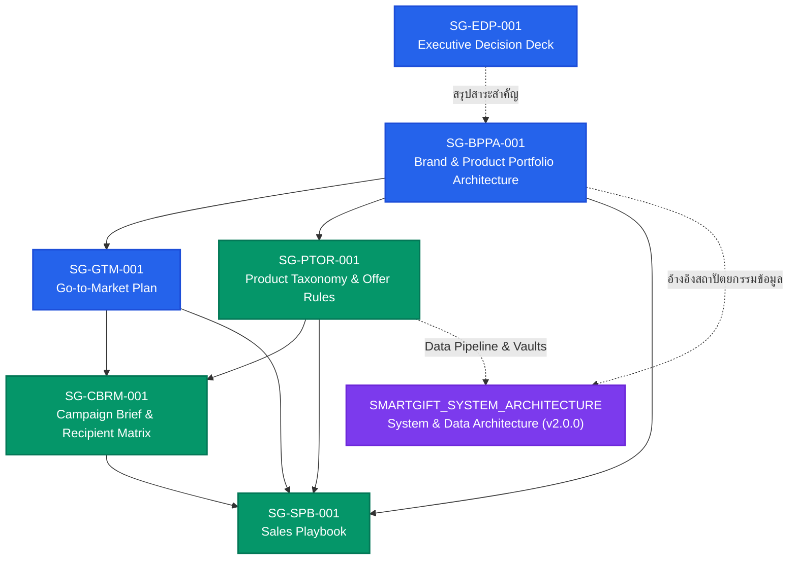

# 📚 SmartGift B2B Business Documentation Index

> **ขอบเขต:** สารบัญและดัชนีนำทางสำหรับชุดเอกสารยุทธศาสตร์ธุรกิจ การตลาด การขาย และสถาปัตยกรรมระบบของ **Business 01: SmartGift** (บริษัท เทราบิส จำกัด / `Therabis Co., Ltd.`) ภายใต้ `Org-EtohGroup` บน `Wannapa Workspace`
>
> **เป้าหมายหลักของชุดเอกสาร:** ขับเคลื่อนการเปลี่ยนผ่านโมเดลธุรกิจของขวัญองค์กรจากการขายแบบ *"ร้านรวมสินค้าพรีเมียม (Item Catalog)"* ไปสู่ **"ระบบออกแบบของขวัญองค์กรตามกลุ่มผู้รับ (Recipient-first Corporate Gifting & Multi-Audience Campaigns)"** สำหรับช่วง Controlled Pilot (90 วัน)

---

## 🧭 แผนผังลำดับชั้นและความสัมพันธ์ของเอกสาร (Document Hierarchy & Flow)

---

## 📋 รายการเอกสารทั้งหมดในชุด (`docs/business/`)

| รหัสเอกสาร (Artifact ID) | ชื่อเอกสาร / ไฟล์ | ประเภทเอกสาร | สถานะ | บทบาทและขอบเขตการใช้งาน |
|---|---|---|:---:|---|
| **`SG-BPPA-001`** | [**`SMARTGIFT-BRAND-PRODUCT-PORTFOLIO-ARCHITECTURE-2026-08.md`**](file:///C:/Users/pc/workspace/Org-01/docs/business/SMARTGIFT-BRAND-PRODUCT-PORTFOLIO-ARCHITECTURE-2026-08.md) | `brand-product-portfolio-architecture` | `beta` | **เอกสารแม่บทกลยุทธ์ (Parent Authority):** กำหนด Brand Positioning, Core Value Proposition, โครงสร้างพอร์ตหลายมิติ (Multi-dimensional) และนิยาม 4 Gift Tiers (`Reach`, `Select`, `Signature`, `Bespoke`) |
| **`SG-EDP-001`** | [**`SMARTGIFT-PORTFOLIO-EXECUTIVE-DECISION-DECK-2026-08.md`**](file:///C:/Users/pc/workspace/Org-01/docs/business/SMARTGIFT-PORTFOLIO-EXECUTIVE-DECISION-DECK-2026-08.md) | `executive-decision-deck-script` | `beta` | **บทสไลด์นำเสนอผู้บริหาร (12 สไลด์):** สรุปประเด็นการตัดสินใจ มติที่ได้รับอนุมัติ และ Activation Gates ก่อนเริ่มทำ Controlled Pilot |
| **`SG-GTM-001`** | [**`SMARTGIFT-GO-TO-MARKET-PLAN-2026-08.md`**](file:///C:/Users/pc/workspace/Org-01/docs/business/SMARTGIFT-GO-TO-MARKET-PLAN-2026-08.md) | `go-to-market-plan` | `beta` | **แผนการเข้าตลาด:** กำหนดขอบเขต Controlled Pilot 90 วัน, การคัดเลือกบัญชีลูกค้าเป้าหมาย (Warm Accounts), แคมเปญ 3 Archetypes, และดัชนีชี้วัดความสำเร็จ (KPIs) |
| **`SG-PTOR-001`** | [**`SMARTGIFT-PRODUCT-TAXONOMY-OFFER-RULES-2026-08.md`**](file:///C:/Users/pc/workspace/Org-01/docs/business/SMARTGIFT-PRODUCT-TAXONOMY-OFFER-RULES-2026-08.md) | `product-taxonomy-and-offer-rules` | `beta` | **การจัดหมวดหมู่และกฎการจัดเซ็ตสินค้า:** มิติการจัดกลุ่มสินค้า (Theme, Tier, Recipient, Format), กฎความพร้อม (Readiness Gates), BOM Assembly, และเงื่อนไขขั้นต่ำ (MOQ/Lead time) |
| **`SG-CBRM-001`** | [**`SMARTGIFT-CAMPAIGN-BRIEF-RECIPIENT-MATRIX-TEMPLATE-2026-08.md`**](file:///C:/Users/pc/workspace/Org-01/docs/business/SMARTGIFT-CAMPAIGN-BRIEF-RECIPIENT-MATRIX-TEMPLATE-2026-08.md) | `campaign-brief-and-recipient-matrix-template` | `beta` | **แม่แบบ Brief & ตารางวิเคราะห์ผู้รับ:** เครื่องมือทำ Discovery ร่วมกับลูกค้าองค์กรเพื่อจัด Segment ผู้รับ และจับคู่ของขวัญตาม Treatment Tier โดยปราศจากข้อมูลส่วนบุคคล (Zero-PII) |
| **`SG-SPB-001`** | [**`SMARTGIFT-SALES-PLAYBOOK-2026-08.md`**](file:///C:/Users/pc/workspace/Org-01/docs/business/SMARTGIFT-SALES-PLAYBOOK-2026-08.md) | `sales-playbook` | `draft` | **คู่มือการขายสำหรับทีม Sales:** Sales Narrative, Talk Tracks, คำถามคัดกรอง (Qualification Gates), การรับมือข้อโต้แย้ง (Objection Handling) และ Privacy Discipline |
| **`SG-CAT-LIST-001`** | [**`2026-09-07-catalog-listing.md`**](2026-09-07-catalog-listing.md) | `catalog-listing` | `beta` | **รายการ catalog แยกสินค้าเดี่ยว / ชุดของขวัญ:** สร้างจาก `product_manifest.json` + `pricelist_public.json` แยกชั้น Core (PM ยืนยันแล้ว) กับ Supplier catalog พร้อมสถานะราคาและสถานะภาพรายรายการ; ข้อมูลเครื่องอ่านอยู่ที่ `public/data/catalog_listing.json` |
| **—** | [**`SMARTGIFT_SYSTEM_ARCHITECTURE.md`**](file:///C:/Users/pc/workspace/Org-01/docs/business/SMARTGIFT_SYSTEM_ARCHITECTURE.md) | `system-and-data-architecture` | `v2.0.0` | **พิมพ์เขียวสถาปัตยกรรมระบบทางเทคนิค:** 4-Tier Cognitive Stack, 5-Stage Data Pipeline, การแยกความรับผิดชอบของระบบ (zuri-ai CRM vs Edge/Vector Vault), และความปลอดภัยข้อมูล Zero-PII |

---

## 🎯 สาระสำคัญและหลักการร่วมของชุดเอกสาร (Core Invariants & Principles)

1. **Recipient-First Paradigm:**
   - เปลี่ยนจากการถามลูกค้าว่า *"อยากได้สินค้าชิ้นไหน"* เป็น *"แคมเปญนี้ให้ใคร วัตถุประสงค์เพื่ออะไร และแต่ละกลุ่มผู้รับควรได้รับการดูแลอย่างไร"*
2. **นิยามของ 4 Gift Tiers (ระดับการดูแล ไม่ใช่ชนิดของสินค้า):**
   - **`Reach`** — ของขวัญจำนวนมากสำหรับงาน Event / Mass Engagement (เน้นความคุ้มค่าและความเร็ว)
   - **`Select`** — ของขวัญมาตรฐานระดับพรีเมียมสำหรับพนักงานหรือลูกค้าทั่วไป (Balanced & Versatile)
   - **`Signature`** — การดูแลระดับพิเศษสำหรับ VIP, Top Partner หรือ High-Impact Stakeholder (High Emotional Touch / Premium Unboxing)
   - **`Bespoke`** — งานสั่งผลิตเฉพาะเจาะจงหรือ Exclusive Collaboration (Fully Customized)
3. **Zero-PII in Git & Vector Vaults:**
   - ข้อมูลชื่อผู้รับ เบอร์โทรศัพท์ ประวัติการซื้อ รายชื่อบัญชีจริง และ PII ต้องอยู่เฉพาะในระบบ CRM / Local Database ที่ควบคุมสิทธิ์เท่านั้น
   - ห้ามเก็บ PII ลงใน Git, Vector Vault (`vlt-catalog-product`), JSON สาธารณะ หรือ Markdown ในเอกสาร
4. **Controlled Pilot Guardrails:**
   - เอกสารทั้งหมดถูกออกแบบมาสำหรับการทดสอบในวงจำกัด (Controlled Pilot 90 วัน) ยังไม่ใช่การ Rollout สาธารณะหรือสิทธิ์ในการให้สัญญาด้านราคา/ระยะเวลาที่เกินกว่า Readiness Gate

---

## 👥 คู่มือการใช้งานตามบทบาท (Role-based Navigation)

- **ผู้บริหาร / ผู้ตัดสินใจ (Executive / Founder):**
  - เริ่มต้นที่ [`SMARTGIFT-PORTFOLIO-EXECUTIVE-DECISION-DECK-2026-08.md`](file:///C:/Users/pc/workspace/Org-01/docs/business/SMARTGIFT-PORTFOLIO-EXECUTIVE-DECISION-DECK-2026-08.md) และ [`SMARTGIFT-BRAND-PRODUCT-PORTFOLIO-ARCHITECTURE-2026-08.md`](file:///C:/Users/pc/workspace/Org-01/docs/business/SMARTGIFT-BRAND-PRODUCT-PORTFOLIO-ARCHITECTURE-2026-08.md)
- **ทีมการตลาดและพัฒนาธุรกิจ (Marketing & BD):**
  - ศึกษา [`SMARTGIFT-GO-TO-MARKET-PLAN-2026-08.md`](file:///C:/Users/pc/workspace/Org-01/docs/business/SMARTGIFT-GO-TO-MARKET-PLAN-2026-08.md) และแม่แบบใน [`SMARTGIFT-CAMPAIGN-BRIEF-RECIPIENT-MATRIX-TEMPLATE-2026-08.md`](file:///C:/Users/pc/workspace/Org-01/docs/business/SMARTGIFT-CAMPAIGN-BRIEF-RECIPIENT-MATRIX-TEMPLATE-2026-08.md)
- **ทีมขาย (Sales Representative / Account Executive):**
  - ใช้งาน [`SMARTGIFT-SALES-PLAYBOOK-2026-08.md`](file:///C:/Users/pc/workspace/Org-01/docs/business/SMARTGIFT-SALES-PLAYBOOK-2026-08.md) ร่วมกับ [`SMARTGIFT-PRODUCT-TAXONOMY-OFFER-RULES-2026-08.md`](file:///C:/Users/pc/workspace/Org-01/docs/business/SMARTGIFT-PRODUCT-TAXONOMY-OFFER-RULES-2026-08.md)
- **ทีมเทคนิคและวิศวกรรมข้อมูล (Engineers & AI Agents):**
  - ตรวจสอบ [`SMARTGIFT_SYSTEM_ARCHITECTURE.md`](file:///C:/Users/pc/workspace/Org-01/docs/business/SMARTGIFT_SYSTEM_ARCHITECTURE.md) และปฏิบัติตามมาตรฐานใน [`AGENTS.md`](file:///C:/Users/pc/workspace/Org-01/AGENTS.md)
