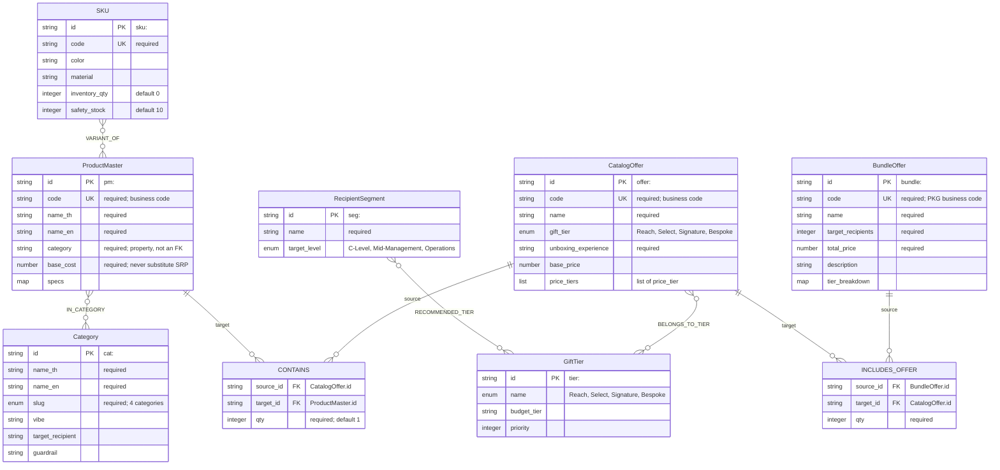
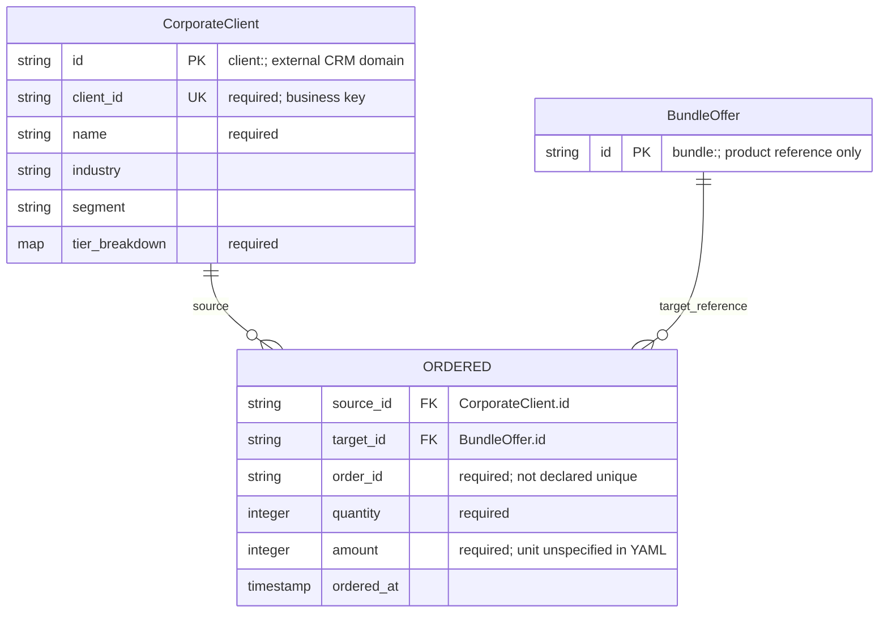

# ERD — SmartGift GenesisBlock

**Authority:** [schema_genesisblock.yaml](../../config/schema_genesisblock.yaml), `client_contract.schema_version = 1.3.0`, `smartgift://b2b/portfolio/v1`.
**ตรวจเทียบ:** 2026-08-30; schema SHA-256 `bcd507d791e406e8114ab636f3905518a58c569791e6d1f87c7b1ef302c00419`.
**อ้างอิง:** [ADR-002](../decisions/ADR-002-PRICELIST-MASTER-SQL-SNAPSHOT.md), [ADR-003](../decisions/ADR-003-SEASONAL-PKG-SCHEMA-PROFIT-GATE.md), [AGENTS.md](../../AGENTS.md).
**Complexity / Risk:** C-1 / LOW — จัดทำเอกสารของโครงสร้างที่มีอยู่ ไม่เปลี่ยน ontology, schema, ราคา, vault หรือ runtime.

## 1. วิธีอ่าน

- นี่คือ **logical ERD ของ graph** ไม่ใช่หลักฐานว่ามี SQL tables, SQL constraints หรือ migration แล้ว
- `id PK` หมายถึง canonical node ID ตาม prefix ใน schema และกฎของโครงการ แม้ YAML ไม่ได้ประกาศ `id` ซ้ำใน properties ของแต่ละ node
- `UK` ใช้เฉพาะ property ที่ YAML ระบุ `unique: true`; คำอธิบาย `required` หมายถึง YAML ระบุ `required: true`
- `source_id FK` และ `target_id FK` คือปลายทางของ graph edge; กล่อง `CONTAINS` และ `INCLUDES_OFFER` แสดง edge ที่มีข้อมูล `qty` ไม่ใช่ node ใหม่
- YAML ยังไม่กำหนด min/max cardinality หรือความไม่ซ้ำของคู่ endpoint จึงใช้ `0..many` ในภาพเพื่อแสดงความสัมพันธ์ที่อาจมีหลายเส้น **ไม่ใช่ข้อบังคับว่าทุกสินค้าต้องมีหลายหมวด หรือทุก offer ต้องมีหลาย tier**
- edge หนึ่งเส้นมี source หนึ่ง node และ target หนึ่ง node; ไม่กำหนด composite PK ให้ edge เอง เพราะ schema ยังไม่ได้กำหนด edge identity/uniqueness

## 2. ERD ของ product catalog

`ProductMaster.category` และ `CatalogOffer.gift_tier` เป็น properties ตาม YAML; การเชื่อม node ใช้ `IN_CATEGORY` และ `BELONGS_TO_TIER` ตามลำดับ ไม่ตีความ string สองช่องนี้เป็น FK โดยอัตโนมัติ

สี่ Category คือ `eco-friendly`, `classic-oriental`, `novelty-self-care`, `executive-smart-tech`; สี่ GiftTier คือ `Reach`, `Select`, `Signature`, `Bespoke` ทั้งสองมิตินี้แยกจาก RecipientSegment และ product family

YAML ไม่ได้กำหนดโครงสร้างย่อยของ `price_tier` ในไฟล์นี้ และไม่ได้ประกาศ currency ของ `base_cost`, `base_price`, `total_price`; consumer ต้องอ่าน basis/currency จาก pricing contract และหลักฐานราคา ไม่อนุมานจากชนิด `number`

## 3. ตาราง FK และความหมายของ edge

| Edge ตาม YAML | Source PK | Target PK | Property ของ edge |
|---|---|---|---|
| IN_CATEGORY | ProductMaster.id | Category.id | ไม่มี |
| VARIANT_OF | SKU.id | ProductMaster.id | ไม่มี |
| CONTAINS | CatalogOffer.id | ProductMaster.id | qty: integer, required, default 1 |
| BELONGS_TO_TIER | CatalogOffer.id | GiftTier.id | ไม่มี |
| RECOMMENDED_TIER | RecipientSegment.id | GiftTier.id | ไม่มี |
| INCLUDES_OFFER | BundleOffer.id | CatalogOffer.id | qty: integer, required |
| ORDERED | CorporateClient.id | BundleOffer.id | order_id, quantity, amount, ordered_at; ดูขอบเขตแยกด้านล่าง |

เส้นทางถอดชุด: `BundleOffer → INCLUDES_OFFER → CatalogOffer → CONTAINS → ProductMaster`.
จำนวนชิ้นต่อ component path = `INCLUDES_OFFER.qty × CONTAINS.qty`; ถ้าสินค้าเดียวกันอยู่หลาย offer จึงค่อยรวมแต่ละ path หลังยืนยันจำนวนและ BOM แล้ว ไม่ใช้จำนวนผู้รับแทน edge quantity โดยอัตโนมัติ

`PKG-*` เป็น `BundleOffer.code` ซึ่งเป็น business key; FK ใน package option/BOM ใช้ `bundle_id → BundleOffer.id`. ตัวอย่าง ID จากไฟล์ปัจจุบันคือ `bundle:smartgift-christmas_2026-select-mid-management`; ห้ามสร้าง ID ใหม่จาก display name หรือเปลี่ยน slug ที่มีอยู่เงียบ ๆ

## 4. CorporateClient และธุรกรรม — อยู่นอก product vault

YAML มี `CorporateClient` และ `ORDERED` แต่ `client_contract.vault_scope` ระบุ Zero PII / Zero Transaction Storage และ AGENTS.md ห้ามเก็บข้อมูลลูกค้าหรือประวัติใบเสนอราคาใน product vault/Git. ภาพนี้จึงบันทึก ontology ให้ครบ **ไม่ได้อนุญาตให้ seed ข้อมูลส่วนนี้เข้า `vlt-catalog-product`**; ข้อมูลจริงต้องอยู่ใน CRM/transaction domain ที่ได้รับอนุญาตแยกต่างหาก

## 5. Mapping ไปยัง JSON ที่มีอยู่

| ไฟล์ / collection | ความหมาย | สถานะที่ตรวจพบ |
|---|---|---|
| [ProductMaster.json](../../data-pipeline/02_prepared/ProductMaster.json) `records` | 16 PM reference records ใช้ `pm:` | ขาด base_cost ทั้ง 16; promoted=false |
| ProductMaster.json `source_projection` | 427 SQL model projections | ไม่ใช่ canonical identity ที่ promote แล้ว; ห้ามรวมด้วยการเดาชื่อ |
| ProductMaster.json `edges.IN_CATEGORY` | 16 category reference edges | target อ้าง Category ใน schema/master; ไม่มี Category records ภายในสามไฟล์นี้ |
| ProductMaster.json `srp_qty_comparisons` | 128 แถว: 16 สินค้า × 8 qty รวม 1 ชิ้น | ตารางราคาอ้างอิง ไม่ใช่ node ใน YAML |
| [CatalogOffer.json](../../data-pipeline/02_prepared/CatalogOffer.json) `records` | 6 seasonal offer candidates ใช้ `offer:` | required fields ครบ แต่ promoted=false |
| CatalogOffer.json `source_projection` | 1,110 SQL offer projections | แยกจาก seasonal records; ไม่ถือว่าพร้อมขาย |
| CatalogOffer.json `edges` | CONTAINS 17; BELONGS_TO_TIER 6 | proposed recipe; required fields ครบไม่ได้พิสูจน์ว่า BOM ถูกยืนยันแล้ว |
| CatalogOffer.json `price_rows` / `price_comparisons` | 669 / 669 แถว | เป็นข้อมูลราคาประกอบ ไม่ใช่ schema node |
| [BundleOffer.json](../../data-pipeline/02_prepared/BundleOffer.json) `records` | 11 BundleOffer candidates จาก alias `pkg` | ขาด target_recipients และ total_price ทุกแถว |
| BundleOffer.json `edges.INCLUDES_OFFER` | 6 เส้นที่มี qty | เป็น reference ที่มีจำนวนแล้ว ไม่ใช่คำสั่งขายที่อนุมัติ |
| BundleOffer.json `edges.INCLUDES_OFFER_PENDING` | 6 รายการรอจำนวน | เป็นชื่อ bucket ของ exporter เท่านั้น **ไม่ใช่ edge type ใน YAML**; ห้าม import เป็น graph edge |
| BundleOffer.json `bom` | 17 component/cost evidence rows | verified=false ทุกแถว; เป็น projection ของเส้นทาง Bundle→Offer→Product ไม่ใช่ BOM node ใหม่ |

Category และ GiftTier อ้างนิยามจาก schema/`pricelist_master.json`; RecipientSegment ปัจจุบันมี reference ใน package metadata แต่สามไฟล์นี้ยังไม่มีชุด RecipientSegment records. SKU/VARIANT_OF และ CorporateClient/ORDERED ก็ไม่ได้ถูกส่งออกในสามไฟล์นี้ จึงไม่ใช่ graph dump ที่ self-contained พร้อม import ทุก node

ค่า `record_counts.canonical_records` เป็นชื่อ metadata ของ exporter ไม่ใช่ใบรับรอง canonical promotion; ให้ตรวจ `contract_validation`, `canonical_promotion`, FK target และหลักฐานก่อนใช้งานจริง

`product_families`, `options`, `profit_evaluation`, `srp_qty_comparisons`, `price_comparisons` เป็นข้อมูลประกอบใน projection; YAML ไม่มี node ชื่อ ProductFamily, PackageOption, ProfitEvaluation หรือ PriceComparison. เช่นเดียวกัน ยังไม่มี edge ตรงจาก BundleOffer ไป RecipientSegment/Category/GiftTier — package targeting ใช้ metadata/options ตาม ADR-003 ไม่ควรสร้าง edge ชนิดใหม่จากภาพนี้

## 6. กติกาทางธุรกิจที่ต้องตรวจเพิ่มจาก schema

- Profit Gate ใช้กำไรไม่น้อยกว่า **25,000 บาทต่อ configured package** ตาม ADR-003: รายได้สุทธิ − ต้นทุนตรงส่งมอบครบทุกหมวด บนฐาน VAT เดียวกัน
- ข้อมูลขาดให้ `missing_inputs`, profit เป็น null และห้ามแสดง `pass`; ทั้ง 11 package ใน snapshot นี้ยังไม่ผ่าน gate
- base_cost ที่ขาดยังเป็น null; ไม่เอา SRP หรือ CBM/freight estimate มาเติมเป็นต้นทุนจริง และไม่แก้ factory evidence เดิมผ่านเอกสารนี้
- qty ของ BOM/package ที่ใช้งานต้องเป็น integer > 0 และ resolve FK ได้; กฎค่าบวกเป็น validation ตาม ADR/TDD เพิ่มจาก YAML ซึ่งระบุเพียง integer/required
- inventory_qty ต้องไม่ติดลบตาม AGENTS.md; ค่า default 0 ใน YAML เพียงอย่างเดียวไม่ได้พิสูจน์ว่ามี database CHECK constraint แล้ว
- ห้ามนำ source_association ระหว่าง model/offer มาแทน CONTAINS โดยเติม qty=1 เอง

## 7. Verification และ version diff

ตรวจเทียบ node properties, prefix, required/unique, edge endpoints และ edge properties กับ YAML; ตรวจจำนวนและสถานะของ JSON ทั้งสามไฟล์จาก disk โดยไม่แก้ไขไฟล์ต้นทาง. ภาพเป็น Mermaid source ใน Markdown; ไม่มีการเปลี่ยน application code, schema, database หรือ deployment

Version diff: ไม่มีเอกสาร → `0.1.0b`: เพิ่ม ERD ของ product catalog, ขอบเขต CRM/transaction แยก, PK/FK, mapping JSON และข้อจำกัดที่ยังไม่พร้อม promote

## CHANGELOG

| Version | Date | Status | Summary | Commit Hash | Agent |
|---|---|---|---|---|---|
| 0.1.0b | 2026-08-30 | draft | บันทึก ERD ตาม GenesisBlock schema 1.3.0 และสถานะ JSON exports | uncommitted | ATHER |
