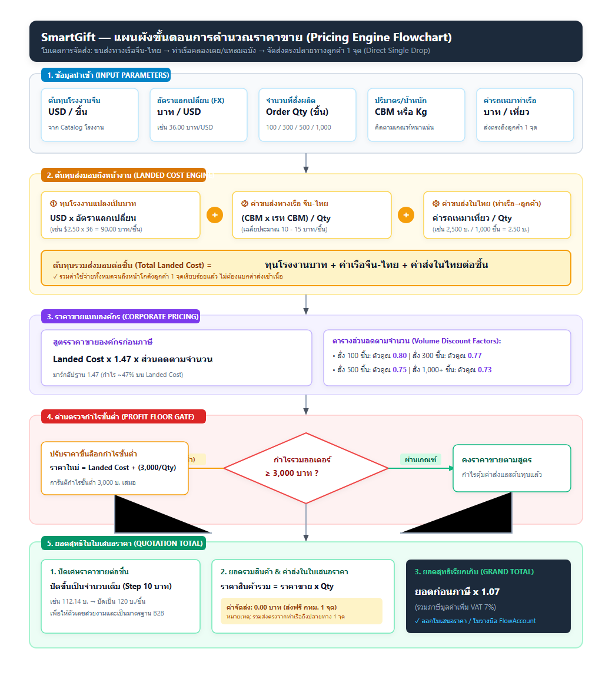
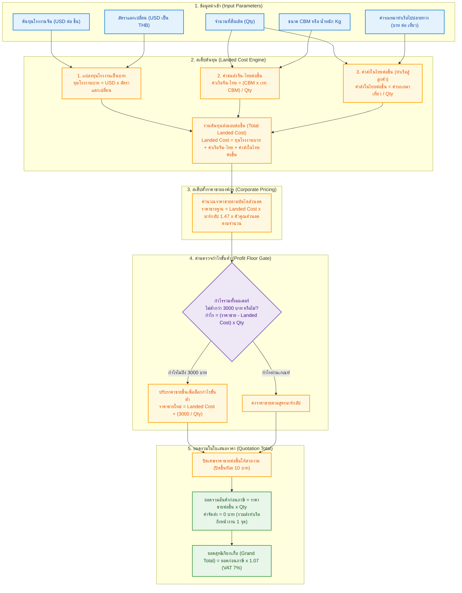

# แผนผังขั้นตอนการคำนวณราคาขาย SmartGift (Pricing Calculation Flowchart)
**เอกสารอ้างอิง:** `docs/specs/PRICING-CALCULATION-FLOWCHART-2026-09-10.md`  
**โมเดลการจัดส่ง:** ท่าเรือไทย -> จุดหมายปลายทางลูกค้า 1 จุด (Direct Port-to-Destination Single Drop)  
**สกุลเงินต้นทาง:** ดอลลาร์สหรัฐ (USD) -> แปลงเป็น บาท (THB)

---

## 1. แผนภาพผังงาน (Visual Flowchart)

---

## 2. สมการคำนวณอย่างง่าย (Human-Readable Formulas)

ใช้เครื่องหมายพื้นฐาน `+` , `x` , `/` ให้อ่านและนำไปเขียนโปรแกรมหรือตั้งสูตร Excel ได้ทันที:

### สเต็ป 1: แปลงต้นทุนโรงงานเป็นเงินบาท
> **ต้นทุนโรงงาน (บาท/ชิ้น)** = ราคาต้นทุนโรงงาน USD x อัตราแลกเปลี่ยน (บาท/USD)

### สเต็ป 2: ค่าขนส่งจีน-ไทยต่อชิ้น (ทางเรือ)
> **ค่าเรือจีน-ไทยต่อชิ้น (บาท)** = (ปริมาตรรวม CBM x ค่าระวางเรือต่อ CBM) / จำนวนชิ้น  
> *(กรณีชั่งน้ำหนัก: ใช้น้ำหนักรวม Kg x ค่าระวางเรือต่อ Kg / จำนวนชิ้น)*

### สเต็ป 3: ค่าขนส่งในไทยต่อชิ้น (ท่าเรือ -> จุดหมายปลายทางเดียว)
> **ค่าส่งในไทยต่อชิ้น (บาท)** = ค่ารถเหมาเที่ยวจากท่าเรือไปส่งลูกค้า (บาท) / จำนวนชิ้น

### สเต็ป 4: ต้นทุนรวมส่งมอบถึงหน้างานลูกค้า (Total Landed Cost)
> **ต้นทุน Landed Cost ต่อชิ้น (บาท)** = ต้นทุนโรงงาน (บาท) + ค่าเรือจีน-ไทยต่อชิ้น (บาท) + ค่าส่งในไทยต่อชิ้น (บาท)

### สเต็ป 5: ราคาขายองค์กรต่อชิ้น (Corporate Selling Price)
> **ราคาขายองค์กรก่อนภาษี (บาท)** = ต้นทุน Landed Cost ต่อชิ้น x 1.47 (มาร์กอัป 47%) x ตัวคูณส่วนลดตามจำนวนชิ้น

* **ตารางตัวคูณส่วนลดตามจำนวน (Volume Discount Factor):**
  * สั่ง 100 ชิ้น: ตัวคูณ `0.80`
  * สั่ง 300 ชิ้น: ตัวคูณ `0.77`
  * สั่ง 500 ชิ้น: ตัวคูณ `0.75`
  * สั่ง 1,000 ชิ้นขึ้นไป: ตัวคูณ `0.73`

### สเต็ป 6: ด่านตรวจกำไรขั้นต่ำ (Profit Floor Gate)
> **กำไรรวมออเดอร์ (บาท)** = (ราคาขายองค์กรต่อชิ้น - ต้นทุน Landed Cost ต่อชิ้น) x จำนวนชิ้น  
> * กฎเกณฑ์: หากกำไรรวม < 3,000 บาท ให้ปรับราคาขายขึ้นเป็น:  
>   **ราคาขายใหม่** = ต้นทุน Landed Cost ต่อชิ้น + (3,000 / จำนวนชิ้น)

### สเต็ป 7: ยอดสุทธิในใบเสนอราคา (Quotation Total)
> **ราคารวมก่อนภาษี (บาท)** = ราคาขายต่อชิ้น x จำนวนชิ้น  
> **ค่าจัดส่งระบุในเอกสาร** = **0 บาท (ระบุเงื่อนไข: รวมค่าจัดส่งจากท่าเรือถึงปลายทาง 1 จุด)**  
> **ยอดสุทธิเรียกเก็บ (บาท)** = ราคารวมก่อนภาษี x 1.07 (รวม VAT 7%)

---

## 3. ตัวอย่างการคำนวณจริงเปรียบเทียบ 2 สเกล (100 ชิ้น vs 1,000 ชิ้น)

### สมมติฐานอ้างอิง:
* สินค้า: แก้วน้ำพรีเมียม / Gift Set
* ทุนโรงงาน = **2.50 USD**
* อัตราแลกเปลี่ยน = **36.00 บาท/USD** -> ทุนโรงงาน = 2.50 x 36.00 = **90.00 บาท/ชิ้น**
* ค่าเรือจีน-ไทย = **12.00 บาท/ชิ้น**
* ค่ารถเหมาเที่ยวเดียวจากท่าเรือส่งลูกค้า = **2,500 บาท/เที่ยว**

| ขั้นตอนการคำนวณ | สั่งล็อตเล็ก (100 ชิ้น) | สั่งล็อตองค์กรใหญ่ (1,000 ชิ้น) |
|---|---|---|
| **1. ทุนโรงงานแปลงเป็นบาท** | 90.00 บาท | 90.00 บาท |
| **2. ค่าเรือจีน-ไทย** | 12.00 บาท | 12.00 บาท |
| **3. ค่าส่งในไทยต่อชิ้น (ท่าเรือ -> ลูกค้า)** | 2,500 / 100 = **25.00 บาท** | 2,500 / 1,000 = **2.50 บาท** |
| **4. ต้นทุนรวม Landed Cost ต่อชิ้น** | 90 + 12 + 25 = **127.00 บาท** | 90 + 12 + 2.50 = **104.50 บาท** |
| **5. ราคาขายก่อนภาษี (หลังมาร์กอัป+ส่วนลด)** | 127 x 1.47 x 0.80 = **149.35 บาท** | 104.50 x 1.47 x 0.73 = **112.14 บาท** |
| **6. ปัดเศษราคาขาย (Step 10 บาท)** | **150.00 บาท/ชิ้น** | **120.00 บาท/ชิ้น** |
| **7. กำไรสุทธิรวมของออเดอร์** | (150 - 127) x 100 = **2,300 บาท** *(ไม่ผ่านเกณฑ์ขั้นต่ำ 3,000 บ.)* -> **ปรับเป็น 157.00 บ.** กำไร = **3,000 บ.** | (120 - 104.50) x 1,000 = **15,500 บาท** *(ผ่านเกณฑ์ขั้นต่ำสบายๆ)* |
| **8. ยอดรวมก่อนภาษี (Subtotal)** | 15,700 บาท | 120,000 บาท |
| **9. ค่าจัดส่งในเอกสาร** | **0 บาท (ส่งฟรี กทม. 1 จุด)** | **0 บาท (ส่งฟรี กทม. 1 จุด)** |
| **10. ยอดสุทธิเรียกเก็บ (รวม VAT 7%)** | **16,799 บาท** | **128,400 บาท** |

---

## 4. ข้อสรุปสำคัญทางธุรกิจ
1. **การส่งตรงจากท่าเรือถึงลูกค้า 1 จุด** ช่วยประหยัดต้นทุนคลังและแรงงานคัดแยกในประเทศได้ 100%
2. **ตัวหารของค่ารถเหมาคือหัวใจของราคาองค์กร:** เมื่อสั่ง 1,000 ชิ้น ค่าขนส่งในไทยลดลงเหลือเพียงชิ้นละ 2.50 บาท (เทียบกับ 25.00 บาทเมื่อสั่ง 100 ชิ้น)
3. **การแบกค่าส่งถูกควบคุมด้วย Profit Floor Gate:** แม้จะบอกลูกค้าว่าส่งฟรี แต่ระบบจะไม่ยอมให้เปิดใบเสนอราคาที่เหลือกำไรสุทธิต่ำกว่า 3,000 บาทเด็ดขาด

---

## 5. โค้ดแผนผัง Mermaid (Mermaid Source Code)

คลิกเพื่อดูโค้ด Mermaid Diagram

