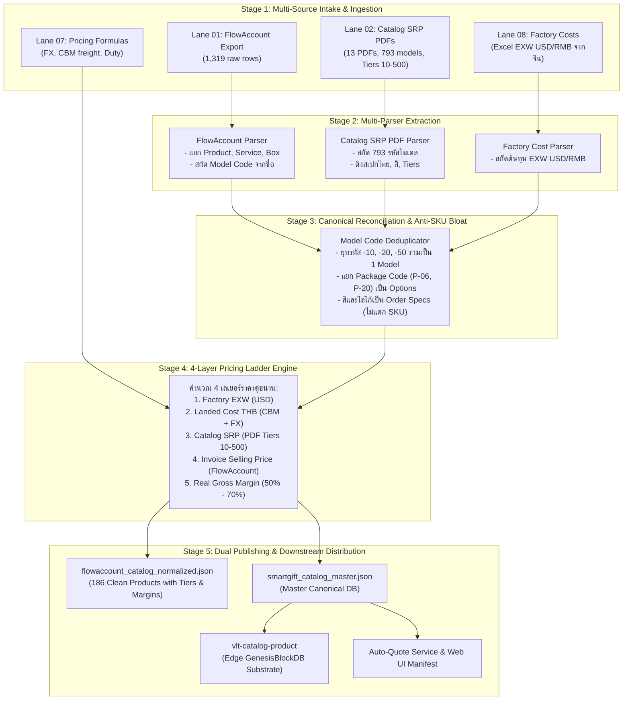

# 🚀 SPEC: SmartGift Catalog Data Flow Architecture & Tri-Source Reconciliation (2026-09-10)

เอกสารฉบับนี้กำหนดสถาปัตยกรรมการไหลของข้อมูล (Data Pipeline Architecture) สำหรับการสร้างแคตตาล็อกสินค้าและระบบคำนวณราคาของ **Business 01: SmartGift (บริษัท เทราบิส จำกัด)** โดยเปรียบเทียบจุดบกพร่องของ **Flow เก่า (Legacy Flow)** กับการออกแบบ **Flow ใหม่ (New Tri-Source Reconciliation Flow)** อย่างละเอียด

---

## 🔍 1. สรุปปัญหาของ Flow เดิม (Legacy Flow Bottlenecks)

ในสถาปัตยกรรมเดิม ข้อมูลสินค้ากระจัดกระจายอยู่ใน 3 แหล่งหลัก แต่กลับไม่มีการเชื่อมโยงกันอย่างสมเหตุสมผล:

```text
[Flow เดิม: ข้อมูลแยกส่วนและทิ้งร้าง]

Lane 01: FlowAccount (1,319 แถว) ───► [02_normalize_mapper.py] ───► smartgift_catalog_master.json (บวม/ไม่ครบ)
                                              ▲
Lane 02: Catalog PDFs (13 เล่ม/793 รุ่น) ─────┴─── [แทบไม่ได้ถูกเรียกใช้เลย! ถูกทิ้งร้างในโฟลเดอร์]
                                              
Lane 08: Factory Costs (Excel จากจีน) ───► [extract_costs] ──────► factory_costs.json (จับคู่กับ FlowAccount ไม่ติด)
```

### ปัญหาสำคัญ 4 ประการของ Flow เดิม:
1. **Lane 02 (`02_catalog_srp_pricelists_pdf`) ถูกทิ้งร้าง:**
   - ในโฟลเดอร์มี PDF แคตตาล็อกและใบเสนอราคาถึง 13 เล่ม (รวมกว่า 110–136 หน้า) ซึ่งเก็บรหัสโมเดลโรงงานถึง 793 รุ่น พร้อมสเปกภาษาไทย, สีที่มี, ขนาด, และ Price Tiers (10, 20, 50, 100, 300, 500)
   - แต่ใน `master_orchestrator.py` สคริปต์หลักกลับ **ไม่เคยอ่านข้อมูลจาก Lane 02 เลยแม้แต่ครั้งเดียว**
   - ส่งผลให้ระบบทิ้งขุมทรัพย์ข้อมูลสเปกภาษาไทยและ Price Tiers ที่สมบูรณ์ที่สุดไปอย่างน่าเสียดาย
2. **เข้าใจผิดเรื่องชื่อโฟลเดอร์ (Misnomer):**
   - Lane 02 ถูกตั้งชื่อว่า `02_factory_pricelists_pdf` ทำให้ทั้งทีมงานและ AI เข้าใจผิดว่าเป็น "ราคาต้นทุนโรงงาน" ทั้งที่แท้จริงคือ "ราคาขายส่งลูกค้า (Catalog SRP)"
3. **ปัญหา SKU บวมขั้นวิกฤตใน Lane 01 (FlowAccount):**
   - มี 1,319 แถว โดยมีกว่า 747 แถวที่ **ไม่มีรหัสสินค้า (รหัสว่างเปล่า)**
   - มีการปั๊มรหัสสินค้าซ้ำแยกตาม Tier จำนวน เช่น `-10`, `-20`, `-50`, `-100`, `-500` และแยกตามกล่อง `(P-06)`, `(P-20)` ทำให้ฐานข้อมูลบวมจนไม่รู้ว่าแท้จริงมีสินค้ากี่ประเภท
4. **Lane 08 (ต้นทุนโรงงานจริง) แมปไม่เข้าเป้า:**
   - มีไฟล์ Excel ต้นทุนจากโรงงานจีน (Shenzhen Zhimei Shiji คิดเป็น USD) แต่เนื่องจากชื่อใน FlowAccount เละและไม่มีรหัส ทำให้จับคู่ต้นทุนจริงไม่สำเร็จ (Confirmed PM mapping = 0)

---

## 📊 2. ตารางเปรียบเทียบ: Flow เก่า vs Flow ใหม่

| มิติการทำงาน | Flow เดิม (Legacy Flow) | Flow ใหม่ (New Tri-Source Flow) |
|---|---|---|
| **การใช้ประโยชน์จาก Lane 02 (PDFs)** | ไม่ได้ใช้ใน pipeline หลัก ถูกทิ้งร้างไว้ในโฟลเดอร์ | **เป็น Source of Truth หลักสำหรับ Catalog SRP, สเปกภาษาไทย, รายการสี และ Tier 10–500** |
| **การจัดการ SKU บวม (Anti-SKU Bloat)** | ปล่อยให้มีแถวซ้ำตาม Tier (`-10`, `-20`, `-50`) รวม 1,319 แถว | **ยุบรวมเป็น Canonical Model เดียว (ลดเหลือ ~186 รุ่นหลัก)** เก็บ Tier เป็น Array ภายใน |
| **การจัดการแถวว่างใน FlowAccount** | มองข้าม 747 รายการที่ไม่มีรหัส | **ใช้ Smart Regex สกัด Model Code จากชื่อสินค้า** และผูกเข้ากับแคตตาล็อก PDF |
| **โครงสร้างราคา (Pricing Architecture)** | สับสนระหว่างราคาขายกับต้นทุน (นำราคาขายมาลบราคาขาย) | **บังคับใช้ 4-Layer Taxonomy:**<br>1. Factory EXW (USD)<br>2. Landed Cost (THB)<br>3. Catalog SRP (PDF)<br>4. Invoice Selling Price (FlowAccount) |
| **การคิดอัตรากำไร (Gross Margin)** | ได้กำไรเพี้ยน 2% – 7% (เพราะเทียบราคาขายกับราคาขาย) | **คำนวณกำไรแท้จริง 50% – 70%** เทียบราคาขายกับ Landed Cost |
| **Orchestration ในระบบ** | รันแบบแยกส่วน รันมือบางสคริปต์ | **ร้อยเรียงผ่าน `master_orchestrator.py` อัตโนมัติทุกขั้นตอน** |

---

## 🏗️ 3. การทำงานของ Flow ใหม่แบบเจาะลึก (New Pipeline Flow Architecture)



---

## ⚙️ 4. รายละเอียดขั้นตอนการประมวลผล (Step-by-Step Pipeline Specification)

### ขั้นตอนที่ 1: การสกัดข้อมูลข้าม 3 แหล่ง (Tri-Source Extraction)
1. **Lane 02 (Catalog SRP PDFs Extractor):**
   - รันอ่านไฟล์ PDF ทั้ง 13 เล่มใน `data-pipeline/01_raw/02_catalog_srp_pricelists_pdf/`
   - สกัดข้อมูลออกมาเป็นฐานข้อมูลอ้างอิง:
     - `factory_code` (เช่น `THB03-2`, `TTB03-2`, `TFS19-2`)
     - `thai_description` (เช่น สเปกสแตนเลส 316, ความจุ, ขนาด)
     - `available_colors` (เช่น ดำ, ขาว, แดง, น้ำเงิน)
     - `catalog_srp_tiers` (ขั้นราคาขาย 10, 20, 50, 100, 300, 500)
2. **Lane 01 (FlowAccount Normalizer):**
   - อ่านไฟล์ `01_flowaccount_exports/บริษัท เทราบิส จำกัด_product.xlsx`
   - แบ่งหมวดหมู่ 1,319 แถวออกเป็น 4 ประเภทอย่างชัดเจน:
     - **PRODUCTS:** สินค้าจริง (ทั้งที่มีรหัสเดิม และสกัดรหัสจากชื่อ)
     - **SERVICES:** บริการสกรีนโลโก้ UV, เลเซอร์, ค่าจัดส่ง (69 รายการ)
     - **PACKAGING:** กล่องบรรจุภัณฑ์ กล่องไม้ กล่องผ้าไหม กระบอก (252 รายการ)
     - **CUSTOM_OFFERS:** รายการแฟลชไดร์ฟสั่งทำพิเศษ (360 รายการ)
3. **Lane 08 (Factory Cost Extractor):**
   - อ่านไฟล์ Excel ใน `01_raw/08_factory_costs/` เพื่อดึงราคาต้นทุนหน้าโรงงานจริง (EXW USD/RMB) จาก Shenzhen Zhimei Shiji

---

### ขั้นตอนที่ 2: การทำ Reconciliation & ยุบ SKU บวม (Anti-SKU Bloat Engine)
1. **ยุบ Tier Suffix:**
   - สินค้าที่มีรหัสลงท้าย `-10`, `-20`, `-50`, `-100`, `-500` จะถูกดึงออกแล้วนำราคามาเรียงเป็นอาร์เรย์ `price_tiers` ภายในสินค้าแม่เพียง 1 Record
2. **แยก Packaging Tag:**
   - สินค้าที่มีแท็กกล่อง เช่น `(P-06)`, `(P-20)`, `(P-PT)` จะถูกดึงแท็กออกเป็น `package_code` สำหรับเลือกลักษณะบรรจุภัณฑ์ ไม่สร้างสินค้าใหม่
3. **จับคู่ข้ามระบบ (Cross-System Matching):**
   - นำ Model Code ที่ได้จาก FlowAccount ไปจับคู่กับฐานข้อมูลของแคตตาล็อก PDF (Lane 02) และต้นทุนโรงงาน (Lane 08)

---

### ขั้นตอนที่ 3: คำนวณราคา 4 เลเยอร์และ Gross Margin แท้จริง
ทุกสินค้าที่จับคู่สำเร็จ จะมีโครงสร้างข้อมูลราคาที่โปร่งใสและตรวจสอบได้ 100%:

```json
{
  "code": "THB03-2",
  "name": "ชุดของขวัญ Vacuum jug+เครื่องนวดคอ",
  "category": "Gift Set",
  "stock_policy": "UNTRACKED",
  "pricing": {
    "factory_cost_usd": 13.08,
    "landed_cost_estimate_thb": 465.0,
    "pricing_tiers": [
      {
        "min_qty": 10,
        "factory_cost_thb": 465.0,
        "catalog_srp_price": 1310.0,
        "flowaccount_selling_price": 1360.0,
        "packaging_delta_thb": 50.0,
        "gross_margin_thb": 895.0,
        "gross_margin_percent": 65.8
      },
      {
        "min_qty": 100,
        "factory_cost_thb": 465.0,
        "catalog_srp_price": 1010.0,
        "flowaccount_selling_price": 1090.0,
        "packaging_delta_thb": 80.0,
        "gross_margin_thb": 625.0,
        "gross_margin_percent": 57.3
      }
    ]
  }
}
```

---

## 🗺️ 5. แผนการปรับปรุงโค้ดและย้ายระบบ (Migration Roadmap)

1. **Step 1:** บรรจุ `pipeline/normalize_flowaccount_catalog.py` เข้าเป็น **Stage 2 (Normalization & Tri-Source Reconciliation)** ของ `pipeline/master_orchestrator.py` แทนตัวเดิมที่ไม่ได้อ่าน PDF
2. **Step 2:** ขยายความสามารถของ PDF Extractor ให้รองรับครบทั้ง 13 เล่มใน `02_catalog_srp_pricelists_pdf/` (ปัจจุบันนำร่องเล่มหลัก 110 หน้า)
3. **Step 3:** อัปเดต `smartgift_catalog_master.json` ให้ดึงโมเดลที่คลีนแล้ว 186 รายการไปเป็น Canonical ProductMaster
4. **Step 4:** สร้างระบบตรวจสอบและรายงานผลอัตโนมัติใน `data-pipeline/04_review_reports/` ทุกครั้งที่มีการรัน Master Pipeline
