# 🏛️ สเปกโครงสร้างข้อมูลระดับองค์กรฉบับสมบูรณ์ (Full Enterprise Master Schema)

- **เวอร์ชัน:** 1.0.0 (Comprehensive Enterprise Architecture)
- **วันที่ประกาศใช้:** 2026-09-10
- **ขอบเขต:** SmartGift (`Business 01`) & Zuri-AI Platform Integration
- **สัญญาเชื่อมต่อ (Contract Path):** [`contracts/smartgift-full-master.schema.json`](file:///c:/Users/pc/workspace/business-01-smart-gift/contracts/smartgift-full-master.schema.json)
- **นิติบุคคลผู้ดำเนินงาน:** บริษัท เทราบิส จำกัด (`Therabis Co., Ltd.`) ภายใต้ `Org-EtohGroup`

---

## 📌 1. วัตถุประสงค์และขอบเขตความครอบคลุม (Scope & Coverage)

Schema ฉบับสมบูรณ์นี้ถูกออกแบบขึ้นเพื่อเชื่อมโยง **7 เสาหลักของระบบพาณิชย์ B2B** เข้าด้วยกันเป็นเนื้อเดียวอย่างสมบูรณ์:

1. **Enterprise Hierarchy & Tenancy:** บริบทความเป็นเจ้าของระดับองค์กร (`Wannapa Workspace` ➔ `Org-EtohGroup` ➔ `Business 01: SmartGift`)
2. **Product Taxonomy & FlowAccount SKU Invariants:** กฎเหล็กการตั้งรหัสสินค้า `Model-Number(Package)` (เช่น `TMS06-4(P-16)`, `BW00-0(P-BAG)`)
3. **Bill of Materials (BOM) & Technical Specs:** รายละเอียดชิ้นส่วนสินค้า สเปกวัสดุ (SUS304/316) ขนาด มิติ และตัวเลือกสี
4. **Unboxing Engineering & Sensory Design:** วิศวกรรมประสบการณ์เปิดกล่อง 4 จังหวะ (4-Stage Reveal) ตามเอกสาร `06_business_pdf`
5. **Costing & Financial Provenance:** การแกะรอยที่มาต้นทุนโรงงานจริง (FX Baseline 34.00 ฿/USD, แถวใน Excel, ค่าเรือ, ค่าสกรีน)
6. **Commercial Pricing & Volume Tiers:** ตารางขั้นบันไดราคาขายทั่วไป (Retail SRP) vs ราคาขายองค์กร (B2B Discount) พร้อม Margin และยอดประหยัด
7. **Data Governance & Compliance:** การบังคับใช้นโยบาย Zero-PII และการควบคุมคำกล่าวอ้างสเปกสินค้า (Claim Governance)

---

## 🗺️ 2. แผนภาพสถาปัตยกรรมข้อมูล (Full Entity Relationship Diagram)

```mermaid
classDiagram
    class EnterpriseContext {
        +String workspace "Wannapa Workspace"
        +String tenant "Org-EtohGroup"
        +String business_id "Business 01: SmartGift"
        +String legal_entity "บริษัท เทราบิส จำกัด"
        +String system_tier "Tier 1: Business Execution"
    }

    class ProductIdentification {
        +String factory_base_model "TMS06 / BW00"
        +String product_items_suffix "-4 / -3 / -0"
        +String factory_item_code "TMS06-4 / BW00-0"
        +String package_suffix "(P-16) / (P-06) / (P-BAG)"
        +String flowaccount_product_code "Model-Count(Package)"
        +String smartgift_internal_code "PM-TMB"
        +String product_family "PF-DRINKWARE"
        +String category "eco-friendly"
    }

    class MarketingPositioning {
        +String philosophy "Recipient-First & Quiet Luxury"
        +String target_treatment_tier "Executive / VIP Partner / Staff"
        +String story_and_concept
        +String hero_feature
    }

    class BillOfMaterials {
        +List~BOMComponent~ components
    }

    class BOMComponent {
        +String item_name "แก้วทัมเบลอร์ 450ml จอ LED"
        +String item_role "Core Drinkware"
        +String material "SUS304 Double-wall Vacuum"
        +String dimensions "65 x 230 mm"
        +List~String~ color_options
    }

    class UnboxingExperience {
        +String stage_1_outer "Matte Sleeve / Gift Bag"
        +String stage_2_gateway "Rigid Box Gold/Silver Foil"
        +String stage_3_anticipation "Vellum Paper / Wax Seal"
        +String stage_4_discovery "Snug Black EVA Molded Foam"
        +List~String~ customization_finishing
    }

    class FinancialProvenance {
        +String source_file "01-ต้นทุน-20260612.xlsx"
        +Int source_row "5846"
        +Float factory_price_usd "2.307692 USD"
        +Float fx_rate_thb_per_usd "34.00 ฿"
        +Float factory_cost_thb_exact "78.4615385 ฿"
        +Float factory_cost_thb_display "78.46 ฿"
    }

    class ShippingAndLogistics {
        +String model "Direct Single Drop (Port-to-Client)"
        +Float flat_rate_trip_thb "2500.00 ฿"
        +Float sea_freight_cbm_rate "2800.00 ฿"
        +Float cbm_per_unit
        +String corporate_quotation_display "0.00 THB (ฟรีค่าจัดส่ง)"
    }

    class PricingTierRow {
        +Int quantity "50 / 100 / 300 / 500 / 1000"
        +Float factory_exw_thb
        +Float sea_freight_thb
        +Float customization_thb
        +Float domestic_freight_thb "2500 / quantity"
        +Float total_landed_cost_thb
        +Float standard_selling_price_thb
        +Float standard_gross_margin_pct "39% - 52%"
        +Float corporate_selling_price_thb
        +Float corporate_gross_margin_pct "20% - 35%"
        +Float corporate_savings_total_thb
    }

    class DataGovernance {
        +Boolean zero_pii_verified true
        +Boolean anti_hyperbole_verified true
        +Int validity_period_days 30
        +String commercial_approval_status "APPROVED_READY_TO_QUOTE"
    }

    SmartGiftMasterPayload *-- EnterpriseContext
    SmartGiftMasterPayload *-- ProductIdentification
    SmartGiftMasterPayload *-- MarketingPositioning
    SmartGiftMasterPayload *-- BillOfMaterials
    SmartGiftMasterPayload *-- UnboxingExperience
    SmartGiftMasterPayload *-- FinancialProvenance
    SmartGiftMasterPayload *-- ShippingAndLogistics
    SmartGiftMasterPayload *-- PricingTierRow
    SmartGiftMasterPayload *-- DataGovernance
```



---

## 💻 3. Full TypeScript Interface (Production Code Ready)

```typescript
/**
 * SmartGift Full Enterprise Master Schema Definition
 * Designed for Zuri-AI Procurement, ERP FlowAccount Adapter & Catalog Engine
 */

export interface EnterpriseContext {
  workspace: "Wannapa Workspace" | string;
  tenant: "Org-EtohGroup" | string;
  business_id: "Business 01: SmartGift" | string;
  legal_entity: "บริษัท เทราบิส จำกัด (Therabis Co., Ltd.)" | string;
  system_tier?: string;
}

export interface ProductIdentification {
  /** รหัสโมเดลหลักจากโรงงาน เช่น TMS06, BW00 */
  factory_base_model: string;
  /** จำนวนชิ้นต่อท้ายด้วยเครื่องหมายลบ เช่น -4, -3, -0 */
  product_items_suffix: `-${number}`;
  /** รหัสโมเดลโรงงานเต็ม เช่น TMS06-4, BW00-0 */
  factory_item_code: string;
  /** รหัสแพ็กเกจในวงเล็บ เช่น (P-16), (P-06), (P-BAG) */
  package_suffix: `(P-${string})`;
  /** ชื่อทางการค้าของแพ็กเกจ */
  package_name?: string;
  /** รหัส FlowAccount ERP หลัก: Model-Count(Package) */
  flowaccount_product_code: `${string}-${number}(P-${string})`;
  /** รหัสอ้างอิงภายใน ProductMaster เช่น PM-TMB */
  smartgift_internal_code?: string;
  product_family?: string;
  category?: string;
  barcode?: string;
}

export interface MarketingPositioning {
  philosophy: "Recipient-First & Quiet Luxury" | string;
  target_treatment_tier: 
    | "Executive / C-Level" 
    | "VIP Partner / Key Account" 
    | "Management & Employees" 
    | "Event / Mass Appreciation";
  story_and_concept?: string;
  hero_feature?: string;
}

export interface BOMComponent {
  item_name: string;
  item_role: string;
  material?: string;
  capacity_or_spec?: string;
  dimensions?: string;
  color_options?: string[];
}

export interface UnboxingExperience {
  stage_1_outer: string;      // Sleeve หรือ ถุงของขวัญ
  stage_2_gateway: string;    // กล่องแข็งจั่วปัง ฝาเปิดดูดอากาศ
  stage_3_anticipation: string; // กระดาษไขซีล หรือการ์ดขอบคุณ
  stage_4_discovery: string;  // โฟม EVA ดำเนียนเข้ารูป
  customization_finishing?: string[]; // เลเซอร์, ฟอยล์ทอง, ฟอยล์เงิน, UV
}

export interface CostAndFinancialProvenance {
  source_file: string;
  source_row: number;
  factory_item_code: string;
  factory_price_formula_usd?: string;
  factory_price_usd: number;
  fx_rate_thb_per_usd: number; // เช่น 34.00
  currency_exchange_formula?: string;
  factory_cost_thb_exact: number; // เช่น 78.4615385
  factory_cost_thb_display: number; // เช่น 78.46
}

export interface ShippingAndLogistics {
  model: 
    | "Direct Single Drop (Port-to-Client)"
    | "Multi-Drop Branch Delivery"
    | "Upcountry Regional Delivery"
    | "Individual Home Fulfillment";
  flat_rate_trip_thb: number; // 2,500 บาท
  sea_freight_cbm_rate?: number;
  cbm_per_unit?: number;
  units_per_carton?: number;
  carton_dimensions_cm?: string;
  corporate_quotation_display: string; // 0.00 THB (ฟรีค่าจัดส่ง)
}

export interface PricingTierRow {
  quantity: number;
  factory_base_code: string;
  items_in_set: number;
  factory_item_code: string;
  package_code: string;
  flowaccount_product_code: string;
  smartgift_product_code?: string;
  
  // ต้นทุน
  factory_exw_usd: number;
  factory_exw_thb: number;
  fx_rate?: number;
  sea_freight_thb: number;
  customization_thb?: number;
  domestic_freight_thb: number; // 2,500 / quantity
  total_landed_cost_thb: number;
  
  // ราคาขายทั่วไป
  standard_selling_price_thb: number;
  standard_gross_profit_unit: number;
  standard_gross_profit_total: number;
  standard_gross_margin_pct: number;
  
  // ราคาขายองค์กร
  corporate_selling_price_thb: number;
  corporate_gross_profit_unit: number;
  corporate_gross_profit_total: number;
  corporate_gross_margin_pct: number;
  
  // ยอดประหยัด
  corporate_savings_per_unit_thb: number;
  corporate_savings_total_thb: number;
}

export interface DataGovernanceAndCompliance {
  zero_pii_verified: boolean;
  anti_hyperbole_verified: boolean;
  validity_period_days: number;
  commercial_approval_status: "DRAFT" | "REVIEW_REQUIRED" | "APPROVED_READY_TO_QUOTE" | "ARCHIVED";
}

export interface SmartGiftFullEnterprisePayload {
  enterprise_context: EnterpriseContext;
  codes_and_identification: ProductIdentification;
  product_name: string;
  product_name_en?: string;
  marketing_positioning?: MarketingPositioning;
  bill_of_materials?: BOMComponent[];
  unboxing_experience?: UnboxingExperience;
  cost_and_financial_provenance: CostAndFinancialProvenance;
  shipping_and_logistics: ShippingAndLogistics;
  pricing_comparison_table: PricingTierRow[];
  data_governance_and_compliance?: DataGovernanceAndCompliance;
}
```

---

## 📐 4. กฎการตรวจสอบความถูกต้องและสูตรคำนวณ (Validation Invariants)

1. **RegEx รหัส FlowAccount**:
   - `^[A-Z0-9]+-[0-9]+\(P-[A-Z0-9]+\)$`
   - ตัวอย่างที่ถูกต้อง: `TMS06-4(P-16)`, `TMS06-3(P-06)`, `BW00-0(P-BAG)`
2. **สูตรกระจายค่าขนส่งแบบ Single Drop**:
   $$	ext{domestic\_freight\_thb} = rac{2,500}{	ext{quantity}}$$
3. **สูตร Landed Cost เต็มรูปแบบ**:
   $$	ext{total\_landed\_cost\_thb} = 	ext{factory\_exw\_thb} + 	ext{sea\_freight\_thb} + 	ext{customization\_thb} + 	ext{domestic\_freight\_thb}$$
4. **ความแม่นยำของต้นทุนโรงงานจริง**:
   $$	ext{factory\_cost\_thb\_exact} = 	ext{factory\_price\_usd} 	imes 	ext{fx\_rate\_thb\_per\_usd (34.00)}$$
5. **นโยบายความปลอดภัย Zero-PII**:
   - ห้ามมีชื่อบุคคล เบอร์โทรศัพท์ หรืองบประมาณเฉพาะลูกค้ารายใดรายหนึ่งหลุดเข้าไปใน Catalog Payload

---

## 📂 5. ทะเบียนสัญญาและการเข้าถึงไฟล์ (Contracts Registry)

* **JSON Schema มาตรฐาน:** [`contracts/smartgift-full-master.schema.json`](file:///c:/Users/pc/workspace/business-01-smart-gift/contracts/smartgift-full-master.schema.json)
* **Spec ฉบับนี้:** [`docs/specs/SPEC-FULL-ENTERPRISE-SCHEMA-2026-09-10.md`](file:///c:/Users/pc/workspace/business-01-smart-gift/docs/specs/SPEC-FULL-ENTERPRISE-SCHEMA-2026-09-10.md)
* **ชุดข้อมูลทดสอบที่ผ่านการ Validate 100%:**
  - [BW00-0_pricing_and_catalog.json](file:///c:/Users/pc/workspace/business-01-smart-gift/docs/specs/BW00-0_pricing_and_catalog.json)
  - [TMS06-4_pricing_and_catalog_extended.json](file:///c:/Users/pc/workspace/business-01-smart-gift/docs/specs/TMS06-4_pricing_and_catalog_extended.json)
  - [TMS06-3_pricing_and_catalog_extended.json](file:///c:/Users/pc/workspace/business-01-smart-gift/docs/specs/TMS06-3_pricing_and_catalog_extended.json)
