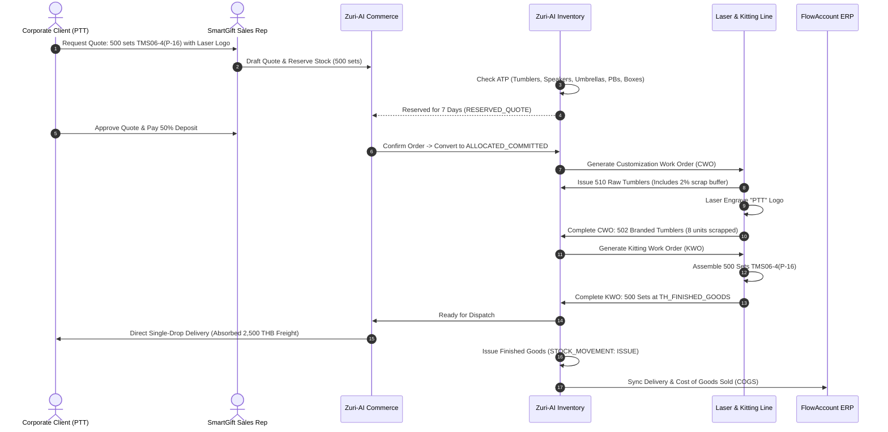

# SPEC-SMARTGIFT-INVENTORY-REQUIREMENTS-FOR-ZURI-AI

> **Document ID:** `SPEC-SMARTGIFT-INVENTORY-2026-09-10`  
> **Status:** `APPROVED FOR ZURI-AI IMPLEMENTATION`  
> **Target System:** Zuri-AI Core (`apps/server`, SCM / Inventory & Warehouse Domain)  
> **Originating Business:** SmartGift (`TN001B01`, Business 01 in EtohGroup ecosystem)  
> **Related Documents:**  
> - [ADR-009: B2B Pricing, Logistics & FlowAccount SKU Architecture](file:///c:/Users/pc/workspace/business-01-smart-gift/docs/decisions/ADR-009-B2B-PRICING-LOGISTICS-AND-FLOWACCOUNT-SKU-ARCHITECTURE.md)  
> - [SPEC-FULL-ENTERPRISE-SCHEMA-2026-09-10.md](file:///c:/Users/pc/workspace/business-01-smart-gift/docs/specs/SPEC-FULL-ENTERPRISE-SCHEMA-2026-09-10.md)  
> - [Zuri-AI SCM Parent Domain (ADR-069)](file:///c:/Users/pc/workspace/zuri-ai/docs/decisions/ADR-069-SCM-PARENT-DOMAIN.md)  
> - [Zuri-AI Procurement Lane (ADR-066 / FR-164 / FR-165)](file:///c:/Users/pc/workspace/zuri-ai/apps/server/src/modules/procurement/application/goods-receipt-service.js)  
> - [Zuri-AI Inventory Core (FR-154 / FR-155 / FR-156)](file:///c:/Users/pc/workspace/zuri-ai/apps/server/src/modules/inventory/domain/inventory.js)  

---

## 1. Executive Summary & Problem Context

### 1.1 Why Standard Retail Inventory Fails SmartGift
Standard e-commerce / retail ERP inventory models assume **simple unitary replenishment** (buy SKU X -> sell SKU X). SmartGift operates as an **On-Demand Corporate Premium Gift & Promotional Merchandise Manufacturer**. Its operational reality consists of:

1. **Dual-Layer Inventory Hierarchy**:
   - **Layer 1: Raw Components & Packaging**: Imported in bulk from Chinese factories (SUS304 tumblers, Qi/MagSafe power banks, umbrella frames, Bluetooth speakers, rigid boxes, die-cut EVA foam, ribbons).
   - **Layer 2: Finished Kitted Bundles**: Sold under standardized FlowAccount SKUs like `TMS06-4(P-16)` or `BW00-0(P-BAG)` assembled on-demand per corporate contract.
2. **Value-Add Customization (WIP)**:
   - Components undergo physical alteration (Laser Engraving, Silk-Screen Printing, UV Flatbed Printing, Box Hot Stamping).
   - **Crucial Invariant**: Once branded with a client's logo (e.g., "PTT", "SCG", "Google"), unbranded raw stock irreversibly transforms into **Customer-Dedicated Stock**. It cannot be returned to generic inventory or re-sold to another client.
3. **Multi-Location Supply Chain Topology**:
   - Tracking stock across China factory EXW, international sea freight consolidation (CBM cargo), customs port clearance, central raw warehouse, screening workshops, assembly lines, and direct single-drop client delivery.
4. **Absorbed Landed Cost & Direct Freight**:
   - Freight is not a post-sale surcharge; the **2,500 THB flat domestic delivery fee** and sea shipping must be amortized into the unit valuation of the inventory batch.
5. **FlowAccount ERP Synchronization**:
   - Bi-directional sync between Zuri-AI's high-fidelity physical/WIP ledger and FlowAccount's accounting item registry.

This document establishes the formal **Requirements (`FR-INV-xxx`)**, **Business Rules (`BR-INV-xxx`)**, **System Design Decisions (`SDD-INV-xxx`)**, and **Edge-Case Refinements** required for Zuri-AI to construct a rock-solid, production-grade Inventory Subsystem for SmartGift.

---

## 2. Domain Topology & Mental Model

```text
┌──────────────────────────────────────────────────────────────────────────────────────────────────┐
│                                    SMARTGIFT SUPPLY CHAIN & INVENTORY                            │
└──────────────────────────────────────────────────────────────────────────────────────────────────┘

 [Stage 1: Chinese Factory] 
       │
       ▼ Purchase Order (PO) - EXW / FOB (USD/CNY)
 [Location: CN_FACTORY]
       │
       ▼ Sea Freight Consolidation (LK Cargo / Shipping Agent - CBM allocation)
 [Location: INTL_SEA_TRANSIT]
       │
       ▼ Customs Clearance & Inbound Trucking
 [Location: TH_PORT_CUSTOMS]
       │
       ▼ Goods Receipt (GRN) + AQL QC Inspection
 ┌─────┴──────────────────────────────────────────────────────┐
 │ Pass                                                       │ Fail
 ▼                                                            ▼
[Location: TH_CENTRAL_RAW]                      [Location: TH_QUARANTINE_SCRAP]
(Unbranded Components & Flat Boxes)             (Factory defects, transit damage)
 │
 ├── [Customization Work Order (CWO)]
 │    │
 │    ▼ Laser Engraving / Screen Printing (WIP)
 │   [Location: TH_WIP_CUSTOMIZATION]
 │    │
 │    ▼ QC Check on Branding & Logo Alignment
 │   [Customer-Dedicated Branded Components] (Locked to Sales Order #)
 │
 └── [Kitting Work Order (KWO)]
      │
      ▼ Assembly: Branded Items + Box (P-16) + EVA Foam + Greeting Card
     [Location: TH_WIP_ASSEMBLY]
      │
      ▼ Final Packaging & Ribbon Tying
     [Location: TH_FINISHED_GOODS] (SKU: TMS06-4(P-16))
      │
      ▼ Dispatch & Delivery Order (DO) - Direct Single-Drop (2,500 THB absorbed)
     [Location: CUSTOMER_SITE] (Delivered / Stock Issued)
```

---

## 3. Product & SKU Taxonomy

In accordance with [ADR-009](file:///c:/Users/pc/workspace/business-01-smart-gift/docs/decisions/ADR-009-B2B-PRICING-LOGISTICS-AND-FLOWACCOUNT-SKU-ARCHITECTURE.md) and Zuri-AI's catalogue architecture:

### 3.1 Item Kinds (`itemKind`)
1. **`RAW_COMPONENT`**: Unbranded hardware or merchandise imported in bulk.
   - Example: `COMP-TUMBLER-SUS304-500ML-MATTE`, `COMP-PB-10000MAH-MAGSAFE`.
   - `stockPolicy`: `TRACKED`.
   - `trackingMode`: `LOT` (or `SERIAL` for high-value power banks).
2. **`PACKAGING_MATERIAL`**: Boxes, linings, and outer cartons.
   - Example: `PKG-BOX-P-16-RIGID`, `PKG-FOAM-EVA-P16-4SLOT`, `PKG-BAG-BW00-CANVAS`.
   - `stockPolicy`: `TRACKED`.
   - `trackingMode`: `NONE` or `LOT`.
3. **`CUSTOM_COMPONENT`**: Branded sub-assembly dedicated to a corporate buyer.
   - Example: `BRANDED-TUMBLER-500ML-PTT-2026Q4`.
   - `stockPolicy`: `TRACKED`.
   - `trackingMode`: `LOT` (locked to `salesOrderId` and `customerId`).
4. **`FINISHED_SET`**: Kitted multi-item gift box matching FlowAccount nomenclature.
   - Format: `[Model]-[ItemCount]([PackageCode])`
   - Example: `TMS06-4(P-16)`, `TMS06-3(P-06)`, `BW00-0(P-BAG)`.
   - `stockPolicy`: `TRACKED`.
   - `trackingMode`: `LOT`.

---

## 4. Business Rules Register (`BR-INV-xxx`)

| Rule ID | Name | Statement / Invariant | Enforced By |
|---|---|---|---|
| **BR-INV-001** | **FlowAccount SKU Compliance** | All finished tradeable gift sets MUST adhere to the regex `^[A-Z0-9]+-[0-9]+\([A-Z0-9_-]+\)$`. Component codes MUST conform to `^[A-Za-z0-9][A-Za-z0-9._-]{1,63}$`. No arbitrary free-text SKU may enter the stock ledger. | Domain Validator |
| **BR-INV-002** | **Customization Irreversibility** | Once a `RAW_COMPONENT` is issued to a `CustomizationWorkOrder` and marked as BRANDED, its state becomes `CUSTOMER_DEDICATED`. It CANNOT be returned to generic raw stock or re-allocated to any other client without a formal Managerial Scrap Write-off (`ADJUSTMENT` movement). | Customization Service |
| **BR-INV-003** | **Landed Cost Absorption Engine** | Inventory valuation MUST reflect fully landed unit cost using Moving Weighted Average (WAVG) or FIFO: `LandedUnitCost = FactoryCostTHB + AllocatedSeaFreight + AllocatedDuty + (2500 THB Inbound Truck / BatchQty) + CustomizationPerUnit + KittingPerUnit`. | Cost Valuation Engine |
| **BR-INV-004** | **BOM Yield & Scrap Loss Factor** | Every `ProductRecipe` (BOM) MUST declare an expected scrap factor ($S_f \in [0.00, 0.15]$). When exploding requirements for an order of $Q$ sets, the gross issue quantity is calculated as $\lceil Q \times (1 + S_f) \rceil$. Unused scrap buffer is reconciled at work order completion. | Recipe Explosion Engine |
| **BR-INV-005** | **Immutable Append-Only Ledger** | No update or delete operations are permitted on `StockMovement`. Current on-hand quantity for any SKU at any location is strictly $\sum \Delta Q$. Corrections are executed exclusively via paired compensating `ADJUSTMENT` movements. | Stock Ledger Service |
| **BR-INV-006** | **Battery FEFO & Shelf-Life Guard** | Electronic components containing Lithium-ion/Polymer batteries (Power banks, Bluetooth speakers) MUST be tracked by `LOT` with `manufacturedAt` and `expiresAt` (or `rechargeByDate` = 180 days from manufacturing). FEFO algorithm rejects lots exceeding safe storage shelf-life. | Allocation & Pick Engine |
| **BR-INV-007** | **Two-Tier Reservation (ATP)** | On-hand inventory is segregated into `PHYSICAL_ON_HAND`, `ALLOCATED_COMMITTED` (linked to confirmed Sales Orders), and `RESERVED_QUOTE` (time-bounded reservation for active B2B quotations, auto-expiring in 7 days). Available-to-Promise: `ATP = PHYSICAL_ON_HAND - ALLOCATED_COMMITTED - RESERVED_QUOTE`. | ATP Calculator |
| **BR-INV-008** | **De-Kitting (Disassembly) Integrity** | Disassembly of a `FINISHED_SET` produces an `ISSUE` of the bundle and paired `RECEIPT` movements for its constituent components. If components were custom-branded, they MUST be returned as `CUSTOM_COMPONENT` or routed to scrap, never as generic `RAW_COMPONENT`. | De-Kitting Service |
| **BR-INV-009** | **Multi-Location Segregation** | Movements MUST specify both source and destination `locationId`. Internal transfers do not change business-wide on-hand, but shift availability between transit, raw, WIP, finished, and quarantine buckets. | Stock Transfer Service |
| **BR-INV-010** | **FlowAccount Synchronization Invariant** | Only `FINISHED_SET` and tradeable standalone merchandise are synchronized to FlowAccount's inventory endpoint. Internal WIP components, raw packaging, and scrap movements remain in Zuri-AI's high-fidelity ledger to prevent bloating FlowAccount. | FlowAccount Adapter |

---

## 5. Functional Requirements Register (`FR-INV-xxx`)

### FR-INV-001: Multi-Location & In-Transit Warehouse Management
- **Target Domain:** Zuri-AI Warehouse Sub-domain (`ADR-069`).
- **Description:** Provide native tracking across 8 distinct location types:
  1. `CN_FACTORY` (Supplier premises in China)
  2. `INTL_SEA_TRANSIT` (Container cargo on vessel)
  3. `TH_PORT_CUSTOMS` (Port arrival / customs inspection)
  4. `TH_CENTRAL_RAW` (Central warehouse unbranded stock)
  5. `TH_WIP_CUSTOMIZATION` (Laser/Screening workshop)
  6. `TH_WIP_ASSEMBLY` (Kitting & packaging workstation)
  7. `TH_FINISHED_GOODS` (Ready to ship corporate sets)
  8. `TH_QUARANTINE_SCRAP` (Defective, broken, or misprinted items)
- **Behavior:**
  - Transfer movements (`TRANSFER`) atomically decrement source location and increment target location within a single database transaction.
  - In-transit visibility provides real-time Estimated Time of Arrival (ETA) tracking for Sea Cargo shipments linked to Purchase Order lines.

### FR-INV-002: Goods Receipt & AQL Quality Control Inspection
- **Target Domain:** Zuri-AI Procurement & Inventory (`FR-165`, `goods-receipt-service.js`).
- **Description:** Implement incoming goods inspection at port / central receiving dock based on ISO 2859-1 / AQL Level II sampling:
  - Total arriving quantity is inspected:
    - `qtyAccepted`: Writes `RECEIPT` movement to `TH_CENTRAL_RAW`.
    - `qtyDefective`: Writes `RECEIPT` movement to `TH_QUARANTINE_SCRAP` with mandatory `defectReason` (e.g., dented tumbler, battery dead on arrival, box water damage).
  - Generates Supplier Defect Claim Report to deduct factory payment or trigger supplier replacement shipment.

### FR-INV-003: Landed Cost Calculation & Direct Freight Amortization
- **Target Domain:** Inventory Costing & Finance.
- **Description:** Automatically compute and persist `costSatang` for all inventory movements:
  $$\text{LandedCost} = \text{FactoryPriceTHB} + \text{SeaFreightShare} + \text{TariffShare} + \frac{2,500\text{ THB}}{\text{BatchQuantity}} + \text{DirectHandling}$$
  - Handles multi-currency conversion (USD/CNY to THB) locked at the customs clearance exchange rate.
  - Automatically absorbs the **2,500 THB direct single-drop truck freight** into the unit valuation so customer-facing delivery appears as 0.00 THB on sales quotes.

### FR-INV-004: Customization & Branding Work Order (WIP Tracking)
- **Target Domain:** Inventory Assembly & Production.
- **Description:** Manage physical transformation of unbranded goods into client-branded items:
  - Input: Raw components from `TH_CENTRAL_RAW`.
  - Process: Laser engraving, silk-screen printing, UV print, or hot stamping.
  - Execution:
    1. Issue raw components: `TRANSFER` from `TH_CENTRAL_RAW` to `TH_WIP_CUSTOMIZATION`.
    2. Post completion: Consumes raw components (`ISSUE`), records scrap (`ISSUE` to Scrap), and produces `CUSTOM_COMPONENT` (`RECEIPT` at `TH_WIP_CUSTOMIZATION`) locked with `customerId` and `salesOrderId`.
  - Scrap Tolerance: If scrap exceeds the declared threshold (e.g. >2%), an automated alert is dispatched to Procurement to replenish shortfall.

### FR-INV-005: Kitting & Assembly Work Order (BOM Transformation)
- **Target Domain:** Inventory Recipes (`FR-156`, `inventory-recipe-service.js`).
- **Description:** Execute on-demand assembly of multi-item gift sets (e.g., `TMS06-4(P-16)`):
  - Explodes `ProductRecipe` for requested batch size $Q$.
  - Atomic Transaction:
    - Issues $Q$ units of each component (e.g. 1x Tumbler, 1x Speaker, 1x Umbrella, 1x Power bank).
    - Issues $Q$ units of packaging (1x Box P-16, 1x Die-cut EVA foam, 1x Ribbon, 1x Card).
    - Produces $Q$ units of `FINISHED_SET` (e.g. `TMS06-4(P-16)`) at `TH_FINISHED_GOODS`.
  - Computes blended unit valuation: Sum of component landed costs + packaging cost + assembly labor cost.

### FR-INV-006: De-Kitting & Disassembly Work Order
- **Target Domain:** Inventory Reverse Logistics.
- **Description:** Allow controlled disassembly of finished sets when customer requirements change or unbranded stock sets are re-purposed:
  - Consumes $Q$ units of `FINISHED_SET`.
  - Produces constituent components back to stock.
  - Enforces Rule `BR-INV-008`: Custom-branded items retain their customer lock; damaged packaging is written off to scrap.

### FR-INV-007: Available-to-Promise (ATP) & Quote Reservation
- **Target Domain:** Inventory & Order Management (`FR-166`).
- **Description:** High-performance real-time calculation of available stock:
  - When a Sales Representative generates an official Quote in SmartGift, the system places a soft reservation (`RESERVED_QUOTE`) valid for 7 calendar days.
  - When the Quote converts to a Sales Order (deposit paid), it converts to `ALLOCATED_COMMITTED`.
  - If a Quote expires without deposit, the reservation automatically releases back to `FREE_AVAILABLE` via a scheduled cron worker.

### FR-INV-008: FlowAccount Inventory Synchronization Adapter
- **Target Domain:** Integration Domain.
- **Description:** Bi-directional synchronization with FlowAccount Open API:
  - Product Catalog Sync: Syncs `FINISHED_SET` SKU codes, descriptions, and sales prices.
  - Stock Adjustment Sync: When a `FINISHED_SET` is assembled or dispatched via Delivery Order, dispatches an inventory update webhook/call to FlowAccount to keep balance sheets aligned.
  - Error Resilience: Implements exponential backoff and idempotency keys to prevent duplicate stock postings during network failures.

### FR-INV-009: Cycle Counting & Stocktake Reconciliation
- **Target Domain:** Inventory Auditing (`FR-155`).
- **Description:** Facilitate periodic blind cycle counts at physical warehouses:
  - Warehouse operators input counted physical units.
  - System computes discrepancy: $\Delta = \text{Counted} - \text{LedgerOnHand}$.
  - Variances exceeding 5,000 THB or 5 units require Business Owner approval before posting compensating `ADJUSTMENT` movements.
  - Creates immutable `AuditEvent` rows recording timestamp, operator, variance, and financial impact.

---

## 6. System Design Decisions & Data Contracts (`SDD-INV-xxx`)

### 6.1 Database Model Extension (Prisma Schema for Zuri-AI)

```prisma
// --- Zuri-AI Inventory Extension for SmartGift (apps/server/prisma/schema.prisma) ---

enum InventoryLocationType {
  CN_FACTORY
  INTL_SEA_TRANSIT
  TH_PORT_CUSTOMS
  TH_CENTRAL_RAW
  TH_WIP_CUSTOMIZATION
  TH_WIP_ASSEMBLY
  TH_FINISHED_GOODS
  TH_QUARANTINE_SCRAP
  CUSTOMER_SITE
}

enum InventoryItemKind {
  RAW_COMPONENT
  PACKAGING_MATERIAL
  CUSTOM_COMPONENT
  FINISHED_SET
}

enum WorkOrderStatus {
  DRAFT
  SCHEDULED
  IN_PROGRESS
  COMPLETED
  CANCELLED
}

enum CustomizationTechnique {
  LASER_ENGRAVING
  SILK_SCREEN
  UV_DIGITAL_PRINT
  HOT_STAMP_FOIL
  EMBOSSING
}

model WarehouseLocation {
  id          String                @id @default(uuid())
  tenantId    String
  businessId  String
  code        String                // e.g. "LOC-TH-RAW-01"
  name        String
  type        InventoryLocationType
  isVirtual   Boolean               @default(false)
  address     String?
  createdAt   DateTime              @default(now())
  updatedAt   DateTime              @updatedAt

  movementsFrom StockMovement[]     @relation("SourceLocation")
  movementsTo   StockMovement[]     @relation("TargetLocation")

  @@unique([tenantId, code])
  @@index([businessId, type])
}

model StockMovement {
  id               String            @id @default(uuid())
  tenantId         String
  businessId       String
  productId        String
  sourceLocationId String?
  targetLocationId String?
  lotId            String?
  kind             String            // RECEIPT, ISSUE, TRANSFER, ADJUSTMENT
  quantity         Int               // Positive integer
  costSatang       Int               // Unit landed cost in satang (THB * 100)
  customerId       String?           // Pinned when stock is CUSTOM_DEDICATED
  salesOrderId     String?           // Pinned when allocated to an order
  workOrderId      String?           // Pinned if generated by CWO or KWO
  reference        String?           // PO:code / GRN:code / DO:code / KWO:code
  reason           String?
  occurredAt       DateTime          @default(now())
  postedByPersonId String?

  sourceLocation   WarehouseLocation? @relation("SourceLocation", fields: [sourceLocationId], references: [id])
  targetLocation   WarehouseLocation? @relation("TargetLocation", fields: [targetLocationId], references: [id])

  @@index([tenantId, businessId, productId])
  @@index([sourceLocationId])
  @@index([targetLocationId])
  @@index([occurredAt])
}

model CustomizationWorkOrder {
  id                String                 @id @default(uuid())
  tenantId          String
  businessId        String
  code              String                 // CWO-YYYYMMDD-NNN
  salesOrderId      String
  customerId        String
  rawProductId      String
  technique         CustomizationTechnique
  logoArtworkUrl    String
  pantoneColorsJson String?                // JSON array of Pantone color codes
  plannedQty        Int
  completedQty      Int                    @default(0)
  scrapQty          Int                    @default(0)
  status            WorkOrderStatus        @default(DRAFT)
  setupCostSatang   Int                    @default(0)
  runCostSatang     Int                    @default(0)
  scheduledDate     DateTime?
  completedDate     DateTime?
  notes             String?
  createdAt         DateTime               @default(now())
  updatedAt         DateTime               @updatedAt

  @@unique([tenantId, code])
  @@index([businessId, status])
  @@index([salesOrderId])
}

model KittingWorkOrder {
  id              String          @id @default(uuid())
  tenantId        String
  businessId      String
  code            String          // KWO-YYYYMMDD-NNN
  salesOrderId    String?
  finishedSkuId   String          // Must be FINISHED_SET e.g. TMS06-4(P-16)
  recipeId        String
  plannedQty      Int
  assembledQty    Int             @default(0)
  scrapQty        Int             @default(0)
  laborCostSatang Int             @default(0)
  status          WorkOrderStatus @default(DRAFT)
  startedAt       DateTime?
  completedAt     DateTime?
  createdAt       DateTime        @default(now())
  updatedAt       DateTime        @updatedAt

  @@unique([tenantId, code])
  @@index([businessId, status])
}
```

---

## 7. Operational Flowcharts & Edge Case Scenarios

### 7.1 Lifecycle of a Custom Corporate Gift Order (End-to-End)



---

## 8. Deep Refinements & Edge Case Analysis ("คิดเผื่อให้เยอะๆ")

### 8.1 Scrap & Defect Threshold Exceedance
- **Problem:** Laser engraving machine misaligns, ruining 5% of raw tumblers (25 units scrapped out of 500), but the safety buffer was only 2% (10 units). The order is now short by 15 units!
- **Specification:**
  1. `CustomizationWorkOrder` status enters `BLOCKED_SHORTAGE`.
  2. System triggers an **Emergency Stock Transfer** from unallocated `TH_CENTRAL_RAW` if available.
  3. If raw stock is 0, the system automatically fires a priority notification to the Procurement Buyer to air-freight 15 replacement blanks from China or source local matching blanks.
  4. The financial loss of the 15 ruined tumblers is booked to `CostCenter: PRODUCTION_SCRAP` rather than inflating the client's quoted price.

### 8.2 Power Bank Lithium Battery Aging & Tropical Shelf-Life
- **Problem:** Lithium-polymer batteries degrade if stored in warehouse temperatures (>30°C) without recharging for >6 months. Shipping a dead power bank to a VIP corporate client ruins SmartGift's reputation.
- **Specification:**
  1. All power bank lots record `manufacturedAt` and `rechargeDeadlineDate = manufacturedAt + 180 days`.
  2. When lot age reaches 150 days, the system generates an automated **Battery Maintenance Task** for warehouse staff to batch-charge power banks to 60-70% nominal storage voltage.
  3. Kitting engine refuses to allocate any power bank lot whose age exceeds 240 days without an explicit certified QC recharge clearance.

### 8.3 Packaging Damage vs Hardware Durability
- **Problem:** During ocean transit, seawater humidity crushes 20 rigid boxes (`PKG-BOX-P-16-RIGID`), but the stainless steel tumblers inside are completely undamaged.
- **Specification:**
  1. The Goods Receipt service allows **asymmetric line receiving**. The inspector accepts 500 tumblers into `TH_CENTRAL_RAW`, but rejects 20 boxes into `TH_QUARANTINE_SCRAP`.
  2. The system flags a **Packaging Shortage Alert** on the Bill of Materials.
  3. The local procurement agent can order 20 replacement boxes from a domestic box maker in Bangkok without delaying the entire Chinese shipment.

### 8.4 Cancelled Corporate Order with Branded WIP
- **Problem:** Corporate client pays a deposit, 500 tumblers are laser engraved with their logo, but the client goes bankrupt or cancels the project before kitting.
- **Specification:**
  1. Branded items are flagged as `ORPHANED_BRANDED_STOCK`.
  2. System executes Rule `BR-INV-002`: Under no circumstances may they return to generic inventory.
  3. Two disposition paths:
     - **De-branding / Rework:** If laser engraving is shallow, investigate buffing/re-coating (rare).
     - **Scrap Write-off:** Formal write-off against the forfeited 50% deposit. Inventory ledger issues stock with reason `ORPHANED_CLIENT_CANCEL`.

### 8.5 Direct Single-Drop Freight Variations
- **Problem:** Standard quotes absorb flat **2,500 THB domestic truck freight**. What if the client specifies delivery to an island (e.g. Koh Samui) or 3 separate branch drops?
- **Specification:**
  1. The landed cost engine absorbs the baseline 2,500 THB into standard inventory valuation.
  2. For secondary drops or island ferry surcharges, the Commerce lane adds an explicit `SURCHARGE_REMOTE_LOGISTICS` line to the invoice, keeping the core inventory unit valuation consistent and audited.

---

## 9. Verification & Acceptance Criteria (Zuri-AI Ready)

1. **Schema Integrity:** All models pass `prisma validate` with zero errors.
2. **Ledger Invariant:** Sum of `StockMovement` quantities mathematically matches on-hand queries across all test suites (`tests/integration/smartgift-inventory.test.js`).
3. **ATP Concurrency:** Concurrent quote reservations correctly lock stock with compare-and-swap, preventing overselling.
4. **BOM Kitting Proof:** Running `buildRecipe` for `TMS06-4(P-16)` atomically deducts 4 components, 1 box, and 1 foam, creating exactly 1 finished gift set row.
5. **Auditability:** Every scrap event, customization failure, and price adjustment leaves a non-repudiable row in `AuditEvent`.
