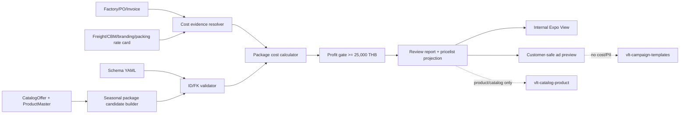

# TDD: Seasonal PKG, Profit Gate ฿25,000 และ Expo View

เอกสารนี้เป็นสัญญาออกแบบที่ Boss อนุมัติแล้วและอยู่ในสถานะ implementation beta สำหรับชุดของขวัญ
องค์กรตามสินค้าที่มีอยู่ใน SmartGift โดยยึด `config/schema_genesisblock.yaml` เป็นสัญญาหลัก ใช้
primary key จาก schema เป็นตัวจริง และให้รหัส `PKG-...` เป็น business key/foreign-key alias
เท่านั้น การอนุมัตินี้ครอบคลุม local JSON projection และ Expo view ตามขอบเขตด้านล่าง แต่ยังไม่ใช่
การอนุมัติราคาโรงงาน, quote, stock reservation หรือ production pricing; การเปิด public
customer-safe endpoint ใช้ขอบเขตแยกตาม [ADR-004](../decisions/ADR-004-CUSTOMER-SAFE-PRICELIST-ENDPOINT.md)

## 1. สรุปการตัดสินใจที่อนุมัติ

| เรื่อง | สัญญาที่อนุมัติ | เหตุผล/ข้อจำกัด |
|---|---|---|
| package node | ใช้ `BundleOffer` ของ schema | schema กำหนด prefix `bundle:` และมี edge `INCLUDES_OFFER` อยู่แล้ว |
| graph primary key | `bundle:<stable-slug>` | ไม่ใช้ `PKG-...` เป็น PK จึงไม่สับสนระหว่าง node ID กับรหัสขาย |
| package business key | `pkg_code = PKG-...` ต้อง unique | ใช้ในใบเสนอราคา/โฆษณา/ค้นหา และเป็น alias ไปยัง `bundle_id` |
| child reference | ทุกแถวของ `pkg_items`, `pkg_costs`, `pkg_creatives` ใช้ `bundle_id` เป็น FK | FK ต้องชี้กลับไปที่ schema PK ไม่ชี้ด้วยข้อความที่อาจเปลี่ยน |
| event window | สมมติ Christmas 2026 และ New Year 2027 | ต้องยืนยันปี วันส่งของ และ cut-off ก่อนสร้างรายการขายจริง |
| company structure | ใช้ `seg:C-Level`, `seg:Mid-Management`, `seg:Operations` และจับคู่กับ `tier:Signature`, `tier:Select`, `tier:Reach` | `GiftTier` เป็นระดับชุดของขวัญ ไม่ใช่ customer segment |
| package gate | กำไรสุทธิระดับคำสั่งซื้อของแต่ละ PKG ต้อง `>= ฿25,000` | เป็น absolute profit gate ไม่ใช่เปอร์เซ็นต์ margin และไม่ผ่านเมื่อข้อมูลต้นทุนไม่ครบ |
| ราคา 1 ชิ้น | เก็บ/แสดงเป็น `qty=1` reference ทุก package/component | ราคา 1 ชิ้นไม่ทำให้ package order ที่ต่ำกว่า gate กลายเป็นผ่าน |
| cost authority | exact factory/PO/invoice + logistics ที่มีหน่วยและช่วงเวลา | ไม่ใช้ `base_cost == SRP`, ชื่อตรงแบบ fuzzy, หรือ estimate เป็นต้นทุนจริง |
| expo | มี internal cost view และ customer-safe ad preview แยกสถานะ | ต้นทุน/กำไร/CBM เป็นข้อมูลภายในและไม่อยู่ใน customer creative |

**Complexity:** C-3 (architecture-driven)
**Risk:** HIGH เพราะแตะ schema projection, ราคา, ต้นทุน, campaign metadata และ UI ที่มี
ความเสี่ยงให้ข้อมูลภายในหลุด

## 2. บริบทและหลักฐานที่ตรวจแล้ว

- ขอบเขตบริษัทคือ tenant `Org-EtohGroup` → business `SmartGift` → operating legal entity
  บริษัท เทราบิส จำกัด (`Therabis Co., Ltd.`); package ใช้โครงสร้างระดับองค์กร ไม่ใช้ชื่อ/PII ลูกค้า
- Schema authority คือ [`config/schema_genesisblock.yaml`](../../config/schema_genesisblock.yaml)
  version 1.3.0, contract `smartgift://b2b/portfolio/v1` และ vault
  `vlt-catalog-product` เป็น product-only/zero-PII
- ProductMaster ใช้ prefix `pm:`, CatalogOffer ใช้ `offer:`, BundleOffer ใช้
  `bundle:`, GiftTier ใช้ `tier:` และ RecipientSegment ใช้ `seg:`
- ความสัมพันธ์ที่ใช้ได้คือ `CONTAINS` (CatalogOffer → ProductMaster) และ
  `INCLUDES_OFFER` (BundleOffer → CatalogOffer) โดยทั้งสอง edge ต้องมี `qty`
- CatalogOffer ใน master ที่ตรวจพบมี `Select` 106 และ `Signature` 251 รายการ แต่ยังไม่มี
  `Reach` หรือ `Bespoke`; จึงห้ามติดป้าย tier Reach/Bespoke ให้ offer เดิมแบบ override
- ผลตรวจ [factory/SRP audit](../../data-pipeline/04_review_reports/pricelist-factory-srp-source-audit-2026-08-30.md)
  ระบุว่า PM canonical 16 รายการจับคู่ factory code แบบ exact ได้ 0/16 และ CBM
  ปัจจุบันเป็น scenario estimate ไม่ใช่ measured freight
- [Pricelist comparison spec](SPEC-PRICELIST-SALE-COST-CBM-COMPARISON-2026-08-30.md)
  ให้ quantity reference `1, 10, 20, 50, 100, 300, 500, 1000` แต่ยังไม่ใช่การ
  อนุมัติ package quote
- ข้อมูล `corporate_bundles` เดิมมีตัวเลขกำไรและ gate ฿20,000 จาก cost ที่ยัง
  ตรวจยืนยันไม่ได้ จึงใช้เป็น historical reference เท่านั้น ไม่ promote เป็น package ใหม่

## 3. Problem และเป้าหมาย

### ปัญหา

1. ตาราง `pricelist_master.json` มี draft package แต่ยังไม่มี BOM ที่มีจำนวนและต้นทุน
   ตรวจสอบได้ครบ
2. รหัส package เดิมปนกับ schema node identity ทำให้เสี่ยงอ้าง FK ด้วย code ที่ซ้ำหรือแก้ได้
3. ราคาขาย, โรงงาน, freight/CBM, branding, packing และ assembly ยังไม่ได้ถูกผูกเป็น
   cost evidence ชุดเดียวกัน
4. UI เดิมแสดง package gate ฿20,000 และข้อมูล corporate bundle เก่า ซึ่งไม่ตรงคำขอ gate ฿25,000
5. ลูกค้าต้องเห็นแนวคิดโฆษณาและรายการของในชุด แต่ทีมขายต้องเห็น cost/profit/CBM และแยกสองมุมมองนี้

### เป้าหมายที่ตรวจรับได้

- สร้าง package candidate จาก CatalogOffer/ProductMaster ที่มี โดยใช้ schema ID เป็น PK
  และ `PKG-...` เป็น unique alias/FK เท่านั้น
- รองรับ Christmas และ New Year พร้อม mapping ตามระดับ C-Level, Mid-Management และ Operations
- คำนวณราคาขาย, ต้นทุนโรงงาน, landed/direct cost, CBM และกำไรด้วย provenance ต่อค่า
- ทำให้ package ที่ต้นทุนไม่ครบหรือกำไรต่ำกว่า ฿25,000 ผ่านไม่ได้โดยอัตโนมัติ
- แสดงราคา 1 ชิ้นควบคู่ quantity ladder โดยไม่ปะปนกับ package order gate
- ออกแบบ Expo View ที่เปิดดูชิ้นส่วนย่อยจาก `BundleOffer → CatalogOffer → ProductMaster`
  และมี ad creative preview ที่ไม่เปิดเผยข้อมูลภายใน

## 4. ขอบเขต

### อยู่ในขอบเขต

- package templates/candidates สำหรับ Christmas 2026 และ New Year 2027
- การ map offer ที่มีอยู่ เช่น `TDD03-2`, `TWL01-8`, `TGC06-4`, `TMK0215`
- schema ID/FK contract, BOM quantity, cost evidence และ profit gate
- price reference ที่ qty 1 และทุก quantity break ที่มีหลักฐาน
- internal Expo View, expandable BOM และ customer-safe ad copy preview
- review report ที่บอก `pass`, `below_minimum`, `cost_pending` หรือ `mapping_pending`

### อยู่นอกขอบเขต

- แก้ raw Excel, raw SQL หรือเปลี่ยน price authority
- เติมต้นทุนจากการเดา, fuzzy SKU matching หรือใช้ SRP เป็น factory cost
- สร้าง CRM/customer record, ชื่อบริษัทลูกค้า, PIC, quotation history หรือ PII ใน product vault
- จอง stock, สร้าง order, ยิงใบเสนอราคา, deploy/public release หรือ publish โฆษณาจริง
- เปลี่ยน taxonomy, เพิ่ม schema node ใหม่ที่ไม่อยู่ใน YAML หรือเปลี่ยนสูตร global โดยพลการ

## 5. ID, PK และ FK contract

### 5.1 Identity rule

ใช้ node ID ตาม prefix ใน schema เป็น immutable primary keyของ graph/projection ดังนี้

| Entity | Schema prefix | ตัวอย่าง PK | Business field | การอ้างอิง |
|---|---|---|---|---|
| BundleOffer | `bundle:` | `bundle:smartgift-2026-christmas-reach-operations` | `pkg_code = PKG-XMAS-2026-REACH-OPS` | parent ของ package rows |
| CatalogOffer | `offer:` | `offer:TDD03-2` | `offer_code = TDD03-2` | `BundleOffer.INCLUDES_OFFER` |
| ProductMaster | `pm:` | `pm:PM-TMB` | `product_code = PM-TMB` | `CatalogOffer.CONTAINS` |
| GiftTier | `tier:` | `tier:Reach` | `name = Reach` | `BELONGS_TO_TIER`/`RECOMMENDED_TIER` |
| RecipientSegment | `seg:` | `seg:Operations` | `name = Operations` | package targeting metadata |
| Category | `cat:` | `cat:eco-friendly` | `slug = eco-friendly` | `IN_CATEGORY` |

กติกาเฉพาะ `PKG`:

1. `bundle_id` เป็น FK ที่ต้อง resolve ได้กับ `BundleOffer.id` ทุกครั้ง
2. `pkg_code` เป็น unique alternate key; ห้ามใช้แทน `bundle_id` ใน edge หรือ cost row
3. ห้ามสร้าง prefix `pkg:` เพราะ schema กำหนด package node เป็น `bundle:`
4. ถ้า legacy caller ต้องส่ง `PKG-...` ให้ resolver แปลงเป็น `bundle_id` แล้วบันทึกทั้ง
   `bundle_id` และ `pkg_code` เพื่อ audit
5. `offer:TDD03-2` เป็น candidate source identity; ก่อน export ต้องตรวจว่า source row
   มี required `name` และ `unboxing_experience` ครบตาม CatalogOffer หากไม่ครบให้เป็น
   `mapping_pending` และห้ามสร้าง identity ใหม่จากชื่อแบบเดา

### 5.2 Package projection ที่เสนอ

`pricelist_master.json` จะถือ `pkg` เป็น projection extension ไม่ใช่ ontology node ใหม่
โดยมีโครงสร้างเชิงสัญญาดังนี้ (เป็น template สำหรับ implementation หลังอนุมัติ):

```json
{
  "pkg": {
    "bundle_id": "bundle:smartgift-2026-christmas-reach-operations",
    "pkg_code": "PKG-XMAS-2026-REACH-OPS",
    "entity_type": "BundleOffer",
    "event_id": "campaign:smartgift-2026-christmas",
    "gift_tier_id": "tier:Reach",
    "recipient_segment_id": "seg:Operations",
    "target_recipients": "<approved integer>",
    "total_price": "<approved number>",
    "status": "cost_pending",
    "includes_offers": [
      { "offer_id": "offer:smartgift-2026-christmas-reach-operations", "qty": 1 }
    ],
    "cost_breakdown": {
      "factory_cost_thb": "<verified or null>",
      "freight_cost_thb": "<verified or null>",
      "branding_cost_thb": "<verified or null>",
      "packaging_cost_thb": "<verified or null>",
      "assembly_cost_thb": "<verified or null>",
      "last_mile_cost_thb": "<verified or null>",
      "total_direct_cost_thb": "<derived or null>"
    },
    "profit_gate": {
      "minimum_profit_thb": 25000,
      "quote_quantity": "<approved integer>",
      "net_revenue_thb": "<derived or null>",
      "profit_thb": "<derived or null>",
      "status": "missing_inputs"
    }
  }
}
```

ตัวอย่างนี้ตั้งใจแสดง contract เท่านั้น ค่า placeholder/null ต้องถูก reject หากพยายาม
export เป็น schema-valid `BundleOffer`; ต้องเติม integer/number และ evidence ให้ครบก่อน
สถานะ `pass` หรือ `approved`

## 6. ชุด package ที่เสนอจากสินค้าที่มี

ปีและวันในตารางเป็น assumption จากวันปัจจุบัน ต้องยืนยันก่อนสร้างรายการขายจริง ทุกแถวเป็น
**candidate** และเริ่มด้วย `cost_pending` หรือ `mapping_pending`; ไม่ได้หมายความว่าผ่าน gate แล้ว

| Bundle PK | PKG code | Event | Tier | Recipient segment | Existing offer candidate | ProductMaster ที่จะถอด | สถานะเริ่มต้น |
|---|---|---|---|---|---|---|---|
| `bundle:smartgift-2026-christmas-reach-operations` | `PKG-XMAS-2026-REACH-OPS` | Christmas 2026 | Reach | Operations | **derived** `offer:smartgift-2026-christmas-reach-operations` | `pm:PM-UMB`, `pm:PM-BOTTLE-LED`, `pm:PM-TMB` | new-offer/mapping/cost pending |
| `bundle:smartgift-2026-christmas-select-mid-management` | `PKG-XMAS-2026-SELECT-MID` | Christmas 2026 | Select | Mid-Management | `offer:TDD03-2` | `pm:PM-UMB`, `pm:PM-BOTTLE-LED`, `pm:PM-TMB` | mapping/cost pending |
| `bundle:smartgift-2026-christmas-signature-c-level` | `PKG-XMAS-2026-SIGNATURE-CLEVEL` | Christmas 2026 | Signature | C-Level | `offer:TGC06-4` | `pm:PM-NB`, `pm:PM-PB10K`, `pm:PM-PEN` | mapping/cost pending |
| `bundle:smartgift-2026-christmas-bespoke` | `PKG-XMAS-2026-BESPOKE` | Christmas 2026 | Bespoke | C-Level / brief-based | offer selected after brief | Product selection required by brief | draft |
| `bundle:smartgift-2027-new-year-reach-operations` | `PKG-NY-2027-REACH-OPS` | New Year 2027 | Reach | Operations | **derived** `offer:smartgift-2027-new-year-reach-operations` | `pm:PM-TMB`, `pm:PM-BOTTLE-LED` | new-offer/mapping/cost pending |
| `bundle:smartgift-2027-new-year-select-mid-management` | `PKG-NY-2027-SELECT-MID` | New Year 2027 | Select | Mid-Management | `offer:TWL01-8` | `pm:PM-AROMA`, `pm:PM-CFMUG`, `pm:PM-MSG` | mapping/cost pending |
| `bundle:smartgift-2027-new-year-signature-c-level` | `PKG-NY-2027-SIGNATURE-CLEVEL` | New Year 2027 | Signature | C-Level | `offer:TMK0215` | `pm:PM-PEN`, `pm:PM-FLASH`, `pm:PM-TEA-INF` | mapping/cost pending |
| `bundle:smartgift-2027-new-year-bespoke` | `PKG-NY-2027-BESPOKE` | New Year 2027 | Bespoke | C-Level / brief-based | offer selected after brief | Product selection required by brief | draft |

แถวที่ระบุ **derived** ใช้ ProductMaster ที่มีอยู่จริง แต่ยังไม่ใช่ CatalogOffer source row
ใน master ต้องสร้างด้วย required fields (`code`, `name`, `unboxing_experience`, `gift_tier`)
และตรวจ source/ราคาใหม่หลังอนุมัติ หากไม่อนุญาตให้สร้าง offer recipe ใหม่ ให้เปลี่ยน
Operations เป็น `Select` จาก offer เดิม หรือคง package ไว้ `draft`; ห้ามเขียน tier ใหม่ทับ
`offer:TDD03-2` เพราะจะทำให้ graph และ customer-facing tier ผิดความหมาย

### Corporate mixed package

สำหรับออเดอร์ที่มีทั้งสามระดับ ให้สร้าง parent `BundleOffer` แยก ไม่เอา `pkg_code` ของ
แต่ละ segment มาต่อ string แล้วถือเป็น package เดียว:

- `bundle:smartgift-2026-christmas-corporate-mix` / `PKG-XMAS-2026-CORP-MIX`
- `bundle:smartgift-2027-new-year-corporate-mix` / `PKG-NY-2027-CORP-MIX`

parent นี้ใช้ `tier_breakdown` และ `INCLUDES_OFFER.qty` ตามจำนวนที่ได้รับอนุมัติจาก
company order brief ของ C-Level, Mid-Management และ Operations เท่านั้น ห้ามใส่จำนวนตัวอย่าง
แบบ hardcode แทนโครงสร้างบริษัทจริง โดย gate ฿25,000 ต้องคิดกับยอดรวมของ parent order
และต้องตรวจ gate ของ child package เพื่อใช้เป็น diagnostic ด้วย

## 7. Company structure และการจัด tier

| Recipient segment ใน schema | GiftTier ที่เสนอ | แนวคิดของขวัญ | ข้อมูลที่ต้องมาจาก order brief |
|---|---|---|---|
| `seg:Operations` | `tier:Reach` | ใช้จริงในงานประจำ/เดินทาง/โต๊ะทำงาน | จำนวนพนักงานระดับ Operations |
| `seg:Mid-Management` | `tier:Select` | wellbeing และ productivity | จำนวนระดับ Mid-Management |
| `seg:C-Level` | `tier:Signature` หรือ `tier:Bespoke` | executive utility และ custom brief | จำนวน C-Level, brief, option และ deadline |

การเลือก tier เป็น recommendation เท่านั้น ไม่ใช่การสร้าง customer tier ใหม่ และไม่เก็บ
ชื่อบุคคลหรือรายชื่อลูกค้าใน `vlt-catalog-product` ใช้เพียงระดับตำแหน่งตาม schema

## 8. ต้นทุน, ราคา และ Profit Gate

### 8.1 หลักฐานต้นทุนที่ยอมรับ

ต้นทุนสินค้าแต่ละ PM ต้องมี identity ที่ตรงกันด้วย code/UPC/variant, catalog source,
supplier, currency, unit, validity และ source hash อย่างน้อยหนึ่งชุดจาก factory catalog,
PO หรือ invoice ที่ทีมงานรับรอง หากไม่มี ให้เป็น `null` และสถานะ `cost_pending` ทันที

ห้ามใช้สิ่งต่อไปนี้เป็น factory cost:

- `ProductMaster.base_cost` ที่เท่ากับ SRP โดยไม่มี source cost evidence
- ราคา SRP หรือราคา offer ladder
- ชื่อสินค้าตรงแบบ fuzzy แต่ code/UPC ไม่ตรง
- ค่า packaging/CBM estimate ที่ยังไม่ระบุว่าเป็น measured หรือ declared scenario
- landed cost/gross profit จาก `corporate_bundles` เดิมที่ยังไม่ audit

### 8.2 สูตรต่อหน่วยและต่อ package

หน่วยเงินเป็น THB หลังแปลงสกุลเงินและต้องระบุฐาน VAT เดียวกันทั้งรายรับและต้นทุน

```text
factory_reference_thb
  = factory_unit_cny × verified_fx_rate

factory_adjusted_thb
  = factory_reference_thb × SOF(quote_quantity)

cbm_each
  = length_cm × width_cm × height_cm / 1,000,000

chargeable_cbm
  = max(sum(component_qty × cbm_each), verified_min_chargeable_cbm)

delivered_unit_cost
  = factory_adjusted_thb
  + freight_thb
  + inland_thb
  + branding_thb
  + packaging_thb
  + assembly_thb
  + last_mile_thb

total_direct_cost
  = sum(component_qty × delivered_unit_cost)
  + fixed_branding_thb
  + fixed_packaging_thb
  + fixed_delivery_thb

net_revenue
  = approved_package_unit_price × quote_quantity

profit_thb
  = net_revenue - total_direct_cost
```

### 8.3 Gate และสถานะ

```text
PASS เฉพาะเมื่อ
  all_required_cost_inputs_are_verified == true
  AND quote_quantity > 0
  AND net_revenue มีฐาน VAT เดียวกับต้นทุน
  AND profit_thb >= 25,000
```

สถานะที่เสนอ:

| สถานะ | ความหมาย |
|---|---|
| `draft` | ยังเลือกสินค้า/จำนวนไม่ครบ |
| `mapping_pending` | offer หรือ PM ยัง reconcile กับ schema/source ไม่ครบ |
| `cost_pending` | มี recipe แต่ factory/logistics/direct cost evidence ไม่ครบ |
| `below_minimum` | คำนวณครบแล้วแต่กำไรต่ำกว่า ฿25,000 |
| `pass` | คำนวณครบและกำไรถึง gate แต่ยังรอผู้อนุมัติ |
| `approved` | ผ่าน gate และมี owner/date อนุมัติใน workflow แยก |
| `rejected` | ไม่ใช้ recipe นี้ต่อ |

`qty=1` ต้องมีแถวราคา/ต้นทุน reference เพื่อให้ทีมเห็นราคาต่อชิ้น แต่ package gate ใช้
`quote_quantity` ของออเดอร์ที่เสนอขายเท่านั้น ถ้า qty 1 ทำกำไรไม่ถึง ฿25,000 ให้แสดง
`below_minimum`; ห้ามเพิ่มกำไรจากการปัดเศษหรือเปลี่ยน basis เงียบ ๆ

### 8.4 ราคา 1 ชิ้นและ quantity ladder

- ProductMaster มี SRP reference ที่ `qty=1` และ ladder `10/20/50/100/300/500/1000`
  ตาม pricelist artifact ปัจจุบัน จะแสดงได้ต่อเมื่อมี source/hash กำกับ
- CatalogOffer ที่ใช้เป็น source candidate หลายรายการมีราคาเริ่มที่ `min_qty=10` เท่านั้น
  จึงห้ามอนุมาน `offer @1` ด้วยการบวก SRP ของ component หรือหารราคาชุดเอง
- ให้แยก field `unit_reference_qty=1`, `offer_price_qty1` และ `package_quote_quantity`;
  ถ้าไม่มีราคา offer ที่ qty 1 ให้ `offer_price_qty1=null` และสถานะ `price_pending`
- แสดงใน Expo เป็นสามแถบ: `component SRP @1`, `offer ladder` และ `package quote/gate`;
  ผู้ใช้จะเห็นราคา 1 ชิ้นตามคำขอโดยไม่ทำให้ราคา package ที่ยังไม่มีฐานกลายเป็น approved

## 9. Ad creative และ Expo View

### 9.1 แยกมุมมองข้อมูล

1. **Internal Expo View (ฝ่ายขาย/ต้นทุน):** แสดง SRP, ราคา qty 1 และ ladder, factory
   reference, landed/direct cost, CBM, profit, evidence และ gate status
2. **Customer-safe Ad Preview:** แสดงชื่อชุด, ภาพสินค้า, use case, tier/segment และ
   ข้อความโฆษณาเท่านั้น ไม่แสดง supplier, factory cost, margin, CBM, audit หรือ PII

การซ่อน field ใน browser ไม่ใช่ access control; หากจะเปิดให้ลูกค้าจริงต้องมี server-side
allowlist/response contract และ public-release review แยกต่างหาก

### 9.2 โครง Expo View

```text
[SmartGift Seasonal Expo]
[Christmas 2026] [New Year 2027] [ทุก tier] [ทุก segment]

[Ad creative canvas]                 [Package facts]
ภาพชุด/2.5D ที่ map ตรง PM             PK: bundle:...
หัวเรื่อง + subtitle                   PKG: PKG-...
badge: cost pending / pass             Event / tier / segment
CTA: ดูของในชุด                        SRP @1 / ladder / quote qty
                                      Profit gate ฿25,000

[BOM explorer]
BundleOffer
 └─ CatalogOffer × qty
     ├─ ProductMaster × qty
     │   ├─ unit cost + source
     │   ├─ CBM + dimension source
     │   └─ inventory status (อ่านอย่างเดียว)
     └─ subtotal / evidence
```

พฤติกรรมที่เสนอ:

- คลิก package card แล้วเปิดรายละเอียดเดิม ไม่เปลี่ยน package ไปเป็นรายการอื่น
- `Expand all`, `Collapse all`, keyboard focus และ `aria-expanded` ใช้ได้โดยไม่ต้องใช้เมาส์
- เมื่อข้อมูลต้นทุนยังไม่ครบ ให้แสดง `รอต้นทุนโรงงาน/โลจิสติกส์ยืนยัน` ไม่แสดง 0 บาท
- customer preview ใช้ถ้อยคำ “ในชุดประกอบด้วย” ส่วน internal ใช้ “BOM/ถอดชิ้นส่วน”
- ใช้ภาพหรือ 2.5D เฉพาะเมื่อจับคู่กับ source code/PM แล้ว; ห้ามภาพแทนสินค้าที่ไม่ยืนยัน
- รองรับ reduced motion และไม่ให้แผงรายละเอียดบังชื่อ/รูปสินค้า

### 9.3 แนวทาง ad creative

| Event | Headline ที่เสนอ | Supporting copy | Visual direction |
|---|---|---|---|
| Christmas 2026 | `ของขวัญปลายปีที่ทีมอยากหยิบใช้จริง` | `เลือกชุดตามบทบาท ตั้งแต่ทีมปฏิบัติการถึงผู้บริหาร` | warm red/green accent, gift unboxing, product-first |
| New Year 2027 | `เริ่มปีใหม่ด้วยของขวัญที่บอกว่าองค์กรใส่ใจ` | `จัดชุดให้เหมาะกับทุกระดับ พร้อมดูรายละเอียดในชุดได้` | clean gold/blue accent, fresh-start light, utility focus |

ข้อความเหล่านี้เป็น draft creative copy ไม่ใช่ claim ด้านสิ่งแวดล้อม, performance หรือ
การรับรองคุณภาพจนกว่าจะมีหลักฐานของสินค้าแต่ละรายการ

## 10. Architecture flow



`vlt-campaign-templates` เก็บ creative/event template แยกจาก product vault และห้ามแก้
ต้นทุนจริงใน catalog; package/order/CRM transaction ยังอยู่ใน application/financial layer
ตาม architecture ของบริษัท

## 11. Acceptance criteria แบบ EARS

- **เมื่อ**สร้าง package candidate **ระบบต้อง**สร้าง `bundle_id` ตาม `bundle:` และ `pkg_code`
  ที่ unique โดยไม่ใช้ `PKG-...` เป็น graph PK
- **เมื่อ** child row อ้าง package **ระบบต้อง** resolve `bundle_id` ได้ และ reject FK ที่
  อ้างเพียง `pkg_code` หรือ id ที่ไม่มีใน BundleOffer
- **เมื่อ** package ใช้ existing offer **ระบบต้อง**ตรวจ `offer:`/`pm:` และ `CONTAINS`/`qty`
  ก่อนสร้าง BOM และแยก `mapping_pending` เมื่อ required field ของ CatalogOffer ขาด
- **ถ้า** factory identity, FX, freight/CBM หรือ direct cost รายการใดขาด **ระบบต้อง**
  ให้ cost/profit เป็น null และไม่ให้สถานะ `pass`/`approved`
- **เมื่อ**ข้อมูลครบและ `profit_thb >= 25,000` **ระบบต้อง**ให้ `pass` พร้อม evidence IDs
  และสูตรที่ใช้
- **เมื่อ**ข้อมูลครบแต่ `profit_thb < 25,000` **ระบบต้อง**ให้ `below_minimum` และแสดง
  ส่วนต่างจาก gate
- **เมื่อ**ผู้ใช้เลือก qty 1 **ระบบต้อง**แสดงราคา 1 ชิ้นแยกจาก quote quantity และไม่
  เปลี่ยนผล package gate
- **เมื่อ**ผู้ใช้กด expand ใน Expo View **ระบบต้อง**แสดงต้นไม้ BundleOffer → CatalogOffer
  → ProductMaster พร้อม qty, cost, CBM และ provenance ที่ตรงรหัส
- **เมื่อ**สลับเป็น customer-safe preview **ระบบต้อง**ไม่ส่ง cost, profit, supplier,
  CBM, audit หรือ PII ใน response
- **ทุกครั้ง**ที่ source snapshot เปลี่ยน **ระบบต้อง**เก็บ hash, source path, validity และ
  generated-at เพื่อย้อนตรวจราคา/ต้นทุนได้

## 12. แผนทดสอบหลังอนุมัติ

### Contract/unit tests

- prefix/uniqueness ของ `bundle_id`, `offer_id`, `pm_id`, `tier_id`, `seg_id`
- FK resolution และ rejection ของ `pkg_code` ที่ไม่มี BundleOffer
- schema-required fields ของ BundleOffer/CatalogOffer และ edge quantity เป็น integer > 0
- exact factory identity; ทดสอบว่า base cost ที่เท่ากับ SRP ไม่ผ่านเป็น cost evidence
- CBM หน่วย cm/m, minimum chargeable CBM และ missing-dimension cases
- SOF/FX/VAT basis และ rounding policy ที่ประกาศใน report
- gate boundary: ฿24,999.99 fail, ฿25,000 pass เมื่อ evidence ครบ, null input never pass
- qty 1 และ ladder `1/10/20/50/100/300/500/1000` ไม่สลับฐานราคา

### Expo/UI tests

- filter event/tier/segment แล้วจำนวนและ package identity ตรงกัน
- expand/collapse ไม่ทำให้รายละเอียดข้าม package
- keyboard, focus, `aria-expanded`, reduced motion และ responsive layout
- internal view มี cost/profit เฉพาะเมื่อ status/evidence อนุญาต
- customer preview ไม่มี internal fields และไม่มี PII
- missing image/mapping แสดงสถานะตามจริง ไม่ใช้ภาพหรือ price fallback ที่ทำให้ดู approved

### Verification boundary

การรัน unit/static/local browser test จะยืนยันเพียง artifact ใน working tree; ยังไม่ถือเป็น
factory quote, customer approval, stock reservation, production deployment หรือ public ad release

## 13. ความเสี่ยงและการป้องกัน

| ความเสี่ยง | ผลกระทบ | การป้องกัน |
|---|---|---|
| factory code ของ PM ไม่ตรง | กำไรและ quote ผิด | exact identity + `mapping_pending` + review report |
| ใช้ estimate เป็น freight จริง | margin สูงเกินจริง | แยก `declared_scenario`/`measured` และไม่ผ่าน gate เมื่อไม่ครบ |
| ลืม branding/packing/assembly | gate หลอกว่าผ่าน | direct-cost checklist บังคับทุก package |
| ใช้ qty 1 เป็น package quote | ขายต่ำกว่าต้นทุน/ต่ำกว่า gate | แยก `unit_reference_qty` กับ `quote_quantity` |
| PKG code ซ้ำ/แก้ได้ | FK ชี้ผิด package | schema node ID เป็น PK, code เป็น unique alias |
| schema required field ขาดใน SQL offer | graph query แตก | validator ก่อน export, ไม่สร้าง offer จากชื่อเดา |
| UI เดิมแสดง gate ฿20,000 | ฝ่ายขายเข้าใจผิด | เปลี่ยนเฉพาะหลังอนุมัติและเพิ่ม regression check ที่ gate 25k |
| creative เผย cost/PII | ข้อมูลภายในรั่ว | customer-safe response allowlist และแยก campaign vault |
| event deadline ไม่ตรง | ผลิต/ส่งไม่ทัน | บังคับ event year, delivery deadline และ owner ใน approval brief |

## 14. Implementation record หลังได้รับอนุมัติ

1. **Phase 0 — contract:** completed ด้วยการอนุมัติของ Boss; ใช้ Christmas 2026 และ New Year 2027
   เป็น event templates และเก็บคำตอบที่ยังไม่ทราบเป็น pending
2. **Phase 1 — Schema projection:** completed; exporter ใช้ `bundle:` เป็น PK, `PKG-...` เป็น alias,
   ตรวจ FK/edge/required fields และสร้าง seasonal offers 6 รายการ
3. **Phase 2 — Cost evidence:** blocked pending source owner; canonical PM 16 รายการยังไม่มี
   exact factory identity จึงไม่ใส่ factory cost, freight หรือ VAT เป็นศูนย์/ค่าประมาณ
4. **Phase 3 — Package/pricelist export:** completed as review projection; ได้ seasonal packages 10
   รายการ, BOM ที่เสนอ 17 edges, ราคา qty 1/ladder ที่มีหลักฐาน และ gate ที่ fail-closed
5. **Phase 4 — Expo View:** completed locally; มี event/tier/segment filters, ad creative canvas,
   expandable BOM และ internal/customer-safe presentation
6. **Phase 5 — verification:** completed locally with exporter checks, unit tests, schema/hash checks
   และ browser smoke test; external quote, inventory, production และ public ad gates ยัง pending

## 15. Open questions ที่ต้องตอบก่อนสร้าง artifact

1. ยืนยันว่า event คือ Christmas 2026 และ New Year 2027 หรือระบุปี/วันส่งที่ถูกต้อง
2. `target_recipients` จะหมายถึงจำนวนคนใน brief หรือจำนวนที่สั่งจริง และแต่ละ segment มีจำนวนเท่าใด
3. อนุมัติให้ใช้ offer candidates `TDD03-2`, `TWL01-8`, `TGC06-4`, `TMK0215` หรือมี offer/code อื่น
   ที่ต้องใช้แทน
4. ใครเป็น owner ที่ยืนยัน factory/PO/invoice mapping ของ PM ทั้ง 16 รายการ และต้องใช้ validity date ใด
5. freight/CBM scenario ใดเป็น quote basis รวมถึง branding, box, packing, assembly, delivery และ VAT
6. ad creative ต้องการภาษาไทยอย่างเดียวหรือ bilingual และจะใช้ในช่องทางใด
7. ต้องการเปิดขายเฉพาะ segment packages หรือให้สร้าง corporate mixed parent package เป็นรายการหลักด้วย

## 16. Public endpoint และ deployment addendum

เพื่อเปิด Expo ให้ลูกค้าโดยไม่ส่งข้อมูลต้นทุนออกสาธารณะ ระบบเพิ่ม public projection จาก
`pricelist_master.json` ด้วย allowlist ที่ตรวจด้วย `validate_public_projection`:

| Endpoint | ขอบเขต response |
|---|---|
| `GET /api/pricelist` | ProductMaster/ProductFamily, 4 catalog, 4 GiftTier, CatalogOffer, SRP qty 1/ladder, seasonal PKG/BOM และ ad creative |
| `GET /api/catalog` | contract เดียวกันสำหรับ loader ของหน้า Expo |
| `GET /api/health` | status, schema version และ counts ที่ไม่ใช่ต้นทุน |

ห้าม response สาธารณะมี factory identity/cost, CBM/freight, profit/margin, supplier,
FlowAccount, source path/hash, provenance, audit, CRM หรือ PII; รับเฉพาะ `GET` และตอบด้วย
`X-SmartGift-Data-Classification: customer-safe` การดูต้นทุนเต็มยังอยู่ที่
`http://localhost:5180/api/pricelist` เท่านั้น

Vercel upload ถูกจำกัดไว้ที่ `public/`, `api/` และ `vercel.json` ด้วย `.vercelignore` เพื่อไม่ส่ง
raw intake, full master, vault หรือ source code ขึ้น deployment ก่อนตรวจ dry-run

## 17. Exit ของเอกสารรอบนี้

เอกสารนี้จบที่ beta implementation ใน local working tree โดยสร้าง JSON projection, Expo view
และ customer-safe endpoint/deployment package แล้ว แต่ไม่เปลี่ยน raw SQL/Excel, calculator เดิม,
vault, inventory หรือ quote/production approval

หลักฐาน local รอบนี้: `pricelist_master.json` schema `1.3.0b` มี seasonal offers 6, package 11
(seasonal 10 + legacy reference 1), BOM ที่เสนอ 17 และ package gate status เป็น
`missing_inputs` ทั้ง 11 รายการ เพราะยังไม่มีต้นทุนโรงงานที่ยืนยันได้, จำนวนสั่งซื้อ และฐานราคา/ภาษี
ที่ครบถ้วน การแสดงผลจึงไม่ประกาศ package ใดว่า `pass` หรือพร้อมขาย

Open questions ในข้อ 15 ยังคงเป็น external gates สำหรับการ promote เป็น quote หรือ production
และไม่ทำให้ local candidate กลายเป็นราคาอนุมัติโดยอัตโนมัติ

## Version diff

- `0.1.0b → 0.2.0b`: Boss อนุมัติสัญญาและสร้าง local implementation ตาม schema; เพิ่ม seasonal offers
  6, seasonal packages 10, BOM ที่เสนอ 17, qty-1/ladder comparison, profit gate fail-closed และ
  Expo view พร้อม customer-safe presentation
- `0.2.0b → 0.3.0b`: เพิ่ม public allowlist artifact, `/api/pricelist`, `/api/catalog`, `/api/health`,
  Vercel upload boundary และ deployment verification โดยไม่เปิดเผย internal cost/evidence

## CHANGELOG

| Version | Date | Status | Summary | Commit Hash | Agent |
|---|---|---|---|---|---|
| 0.3.0b | 2026-08-30 | beta | เพิ่ม customer-safe API allowlist, Vercel upload boundary และ deployment gates | uncommitted | ATHER |
| 0.2.0b | 2026-08-30 | beta | Boss อนุมัติและสร้าง local seasonal PKG/offer/BOM projection พร้อม gate ฿25,000 และ Expo view | uncommitted | ATHER |
| 0.1.0b | 2026-08-30 | candidate | ออกแบบ seasonal PKG, schema PK/FK, cost evidence, gate ฿25,000 และ Expo/ad creative | uncommitted | ATHER |
