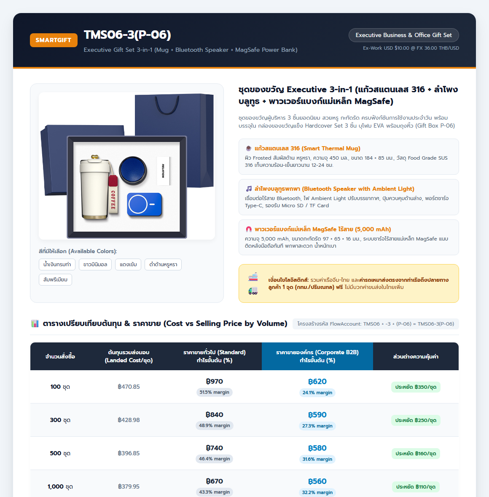

# ข้อมูลจำลองหน้าแคตตาล็อก & อินโฟกราฟิกราคา TMS06-3(P-06)
**เอกสารอ้างอิง:** `docs/specs/TMS06-3-PRICING-CATALOG-INFOGRAPHIC-2026-09-10.md`  
**รหัสใน FlowAccount:** `TMS06-3(P-06)`  
**ไฟล์ JSON โครงสร้างราคา:** [`TMS06-3_pricing_and_catalog_extended.json`](TMS06-3_pricing_and_catalog_extended.json)  
**ไฟล์ Google Sheets / Excel:** [`TMS06-3_P-06_pricing_comparison_sheet.xlsx`](TMS06-3_P-06_pricing_comparison_sheet.xlsx)  
**ไฟล์ CSV (Google Sheets):** [`TMS06-3_pricing_comparison_sheet.csv`](TMS06-3_pricing_comparison_sheet.csv)

---

## 1. ภาพจำลองแคตตาล็อกสินค้า & อินโฟกราฟิกราคา (Infographic Catalog)

---

## 2. โครงสร้างรหัส FlowAccount & การแยกแยะระบบรหัส (Code Architecture)

$$\mathbf{\text{รหัส FlowAccount}} = \text{รหัสโมเดลโรงงาน [TMS06]} + \text{จำนวนชิ้นในชุด [-3]} + \text{รหัสแพ็กเกจกล่อง [(P-06)]} = \mathbf{TMS06-3(P-06)}$$

| ส่วนประกอบรหัส | รหัส | คำอธิบายและความหมาย |
|---|:---:|---|
| **1. รหัสโรงงาน (Factory Model)** | **`TMS06`** | รหัสโมเดลสินค้าจากโรงงานจีน (Shenzhen Zhimei Shiji Industrial Co., Ltd.) |
| **2. จำนวนชิ้นในชุด (Item Suffix)** | **`-3`** | จำนวน 3 ชิ้นในเซ็ต (แก้วสแตนเลส 316 + ลำโพงบลูทูธ + พาวเวอร์แบงก์ MagSafe) |
| **3. รหัสโรงงานเต็ม** | **`TMS06-3`** | รหัสที่โรงงานใช้เรียกเซ็ต 3 ชิ้น |
| **4. รหัสแพ็กเกจกล่อง (Package Code)** | **`P-06`** | รหัสกล่องของขวัญแข็ง Hardcover Set 3 ชิ้น บุโฟม EVA พร้อมถุงหิ้วเข้าชุด |
| **5. รหัสใน FlowAccount เต็ม** | **`TMS06-3(P-06)`** | **รหัสสินค้าทางการที่บันทึกในระบบบัญชี FlowAccount เทราบิส** |
| **6. รหัสสินค้า SmartGift** | **`SG-TMS06-3(P-06)`** | รหัส SKU ภายในของระบบ SmartGift (Offer: `OFFER_TMS06-3`) |
| *รหัสชิ้นส่วน BOM ภายในคลัง* | `PM-CFMUG` `PM-SPK` `PM-PB05K` | รหัสตัดสต็อกแยกชิ้น: แก้วมัคสแตนเลส, ลำโพงบลูทูธ, พาวเวอร์แบงก์แม่เหล็ก MagSafe |

---

## 3. วัสดุที่มีให้เลือก (Material Specifications)

1. **แก้วมัคสแตนเลส 316 (Smart Thermal Mug 450ml):**
   * ด้านใน: สแตนเลสสตีลเกรดการแพทย์ **SUS 316 Food Grade** เก็บความร้อน-เย็น 12–24 ชม.
   * ด้านนอก: เคลือบผิวด้านสัมผัสหรูหรา (**Frosted Matte Touch**) ไม่เป็นรอยนิ้วมือ
   * ฝาและขอบ: พลาสติก Food Grade PP พร้อมซีลซิลิโคนป้องกันน้ำหก 100%
2. **ลำโพงบลูทูธพกพา (Bluetooth Speaker with Ambient Light):**
   * บอดี้พลาสติก ABS พรีเมียมทนความร้อน + ตะแกรงเสียงโลหะ Micro-Perforated
   * โคมไฟอะคริลิกใสฝังไฟ **Ambient Light** ปรับแสงสร้างบรรยากาศ
   * พอร์ตชาร์จ Type-C + ช่องเสียบการ์ด Micro SD / TF Card
3. **พาวเวอร์แบงก์แม่เหล็ก MagSafe ไร้สาย (5,000 mAh):**
   * บอดี้ ABS + PC เกรดกันลามไฟ แถบแม่เหล็กดูดแรงสูง แนบสนิทด้านหลังโทรศัพท์
   * แบตเตอรี่ **Lithium-Polymer 5,000 mAh** มาตรฐาน มอก. พกขึ้นเครื่องบินได้ ขนาดบางเบา 97 × 65 × 16 มม.
4. **กล่องบรรจุภัณฑ์ (Gift Packaging P-06):**
   * กล่องของขวัญ Hardcover Box ฝาครอบประกบแม่เหล็ก บุโฟม EVA สีดำเซาะร่องล็อค 3 ชิ้นพอดีตัว + ถุงหิ้วกระดาษอาร์ตการ์ดพิมพ์สีเข้าชุด

---

## 4. สีที่มีให้เลือก (Color Options)

* 🔵 **น้ำเงินกรมท่า (Navy Blue)** — รหัส `NAVY` (Hex: `#1E3A8A`)
* ⚪ **ขาวมินิมอล (Classic White)** — รหัส `WHITE` (Hex: `#F8FAFC`)
* 🔴 **แดงเข้ม (Crimson Red)** — รหัส `RED` (Hex: `#991B1B`)
* ⚫ **ดำด้านหรูหรา (Matte Black)** — รหัส `BLACK` (Hex: `#0F172A`)
* 🟠 **ส้มพรีเมียม (Vibrant Orange)** — รหัส `ORANGE` (Hex: `#EA580C`)

---

## 5. ตัวเลือกค่าขนส่ง (Shipping Options)

* **ตัวเลือก A (มาตรฐาน - ที่ใช้ในตาราง): ขนส่งตรงจากท่าเรือถึงปลายทาง 1 จุด (Direct Port-to-Client)**
  * **ในใบเสนอราคา:** แสดงเป็น **`0.00 บาท` (ฟรี - รวมค่าจัดส่งในราคาสินค้าเรียบร้อยแล้ว)**
  * **ต้นทุนภายในจริง:** เหมารถกระบะ 4 ล้อใหญ่จากท่าเรือตรงไปส่งลูกค้าจุดเดียว 2,500 บาท/เที่ยว (เฉลี่ยชิ้นละ 2.50 – 25.00 บ. ตามจำนวนสั่งซื้อ)
* **ตัวเลือก B: กระจายจัดส่งหลายสาขา (Multi-Drop Branch Delivery)**
  * จุดแรกจัดส่งฟรี / จุดถัดไปคิดค่าบริการเพิ่ม **500 – 1,200 บาทต่อจุด** ตามระยะทางจริง (ระบุเป็นบรรทัดบริการเสริมในใบเสนอราคา)
* **ตัวเลือก C: จัดส่งปลายทางต่างจังหวัด (Upcountry Regional Delivery)**
  * เหมารถขนส่งประจำจังหวัด หรือส่งผ่านขนส่งเอกชน คิดตามระยะทาง/น้ำหนักจริง (**1,200 – 2,500 บาท/เที่ยว**)
* **ตัวเลือก D: จัดส่งรายบุคคลถึงบ้านพนักงาน/ลูกค้า VIP (Individual Home Delivery & WFH)**
  * บริการคัดแยกสินค้า บรรจุกล่องพัสดุรายชิ้น ติดจ่าหน้า และจัดส่งผ่าน Kerry / Flash คิดค่าบริการรวมค่าส่ง **55 – 75 บาท/ชุด**

---

## 6. ตารางเปรียบเทียบต้นทุน vs ราคาขายทั่วไป vs ราคาขายองค์กร (พร้อม Margin)

| จำนวนสั่งผลิต | รหัสโมเดล | ชิ้นในชุด | รหัสโรงงาน | รหัสแพ็กเกจ | รหัส FlowAccount | รหัส SmartGift | ทุนโรงงาน (USD) | ทุนโรงงาน (บาท) | ค่าเรือจีน-ไทย | ค่ารถส่งในไทย | ต้นทุนรวม Landed Cost | ราคาขายทั่วไป | กำไรทั่วไป (บาท) | Margin ทั่วไป (%) | ราคาขายองค์กร | กำไรองค์กร (บาท) | Margin องค์กร (%) | ลูกค้าประหยัด/ชุด | ประหยัดรวมทั้งดีล |
|:---:|:---:|:---:|:---:|:---:|:---:|:---:|:---:|:---:|:---:|:---:|:---:|:---:|:---:|:---:|:---:|:---:|:---:|:---:|:---:|
| **100 ชุด** | TMS06 | -3 | TMS06-3 | (P-06) | **TMS06-3(P-06)** | SG-TMS06-3(P-06) | $11.50 | ฿414.00 | ฿31.85 | ฿25.00 | **฿470.85** | **฿970** | ฿49,915 | **51.5%** | **฿680** | ฿20,915 | **30.8%** | **฿290** | **฿29,000** |
| **300 ชุด** | TMS06 | -3 | TMS06-3 | (P-06) | **TMS06-3(P-06)** | SG-TMS06-3(P-06) | $10.80 | ฿388.80 | ฿31.85 | ฿8.33 | **฿428.98** | **฿840** | ฿123,306 | **48.9%** | **฿600** | ฿51,306 | **28.5%** | **฿240** | **฿72,000** |
| **500 ชุด** | TMS06 | -3 | TMS06-3 | (P-06) | **TMS06-3(P-06)** | SG-TMS06-3(P-06) | $10.00 | ฿360.00 | ฿31.85 | ฿5.00 | **฿396.85** | **฿740** | ฿171,575 | **46.4%** | **฿580** | ฿91,575 | **31.6%** | **฿160** | **฿80,000** |
| **1,000 ชุด** | TMS06 | -3 | TMS06-3 | (P-06) | **TMS06-3(P-06)** | SG-TMS06-3(P-06) | $9.60 | ฿345.60 | ฿31.85 | ฿2.50 | **฿380.00** | **฿670** | ฿290,000 | **43.3%** | **฿560** | ฿180,000 | **32.1%** | **฿110** | **฿110,000** |
