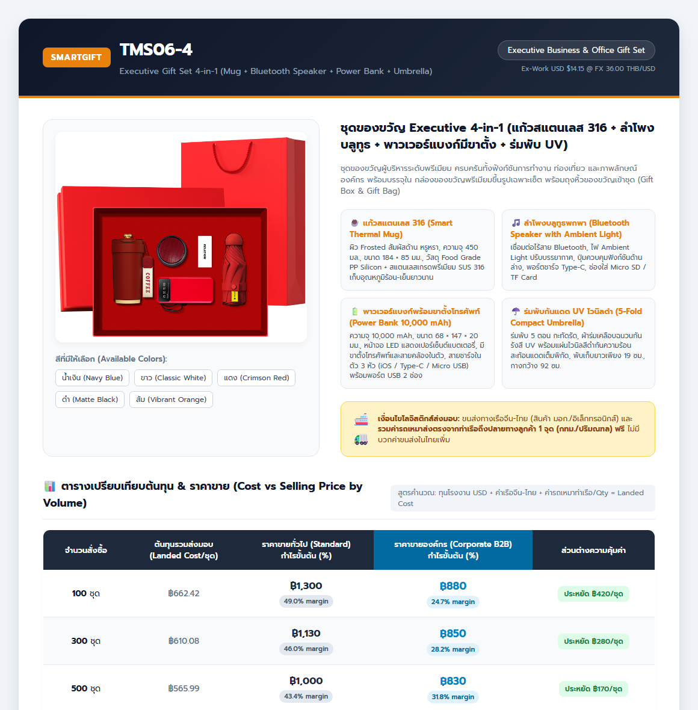

# ข้อมูลจำลองหน้าแคตตาล็อก & อินโฟกราฟิกราคา TMS06-4
**เอกสารอ้างอิง:** `docs/specs/TMS06-4-PRICING-CATALOG-INFOGRAPHIC-2026-09-10.md`  
**รหัสสินค้า:** `TMS06-4` (Executive Business Gift Set 4-in-1)  
**ไฟล์ JSON โครงสร้างราคา:** [`TMS06-4_pricing_and_catalog.json`](TMS06-4_pricing_and_catalog.json)  
**ไฟล์ HTML แคตตาล็อกจำลอง:** [`../../outputs/TMS06-4_catalog_infographic.html`](../../outputs/TMS06-4_catalog_infographic.html)

---

## 1. ภาพจำลองแคตตาล็อกสินค้า & อินโฟกราฟิกราคา (Infographic Catalog)

---

## 2. รายละเอียดสินค้า (Product Specifications)
* **ชื่อภาษาไทย:** ชุดของขวัญ Executive 4-in-1 (แก้วสแตนเลส 316 + ลำโพงบลูทูธ + พาวเวอร์แบงก์มีขาตั้ง + ร่มพับ UV)
* **ชื่อภาษาอังกฤษ:** Executive Gift Set 4-in-1 (Mug + Bluetooth Speaker + Power Bank + Umbrella)
* **หมวดหมู่:** Executive Business & Office Gift Set
* **บรรจุภัณฑ์:** กล่องของขวัญพรีเมียมขึ้นรูปเฉพาะเซ็ต พร้อมถุงหิ้วของขวัญเข้าชุด (Gift Box & Gift Bag)
* **สีที่มีให้เลือก:** น้ำเงิน (Navy Blue), ขาว (Classic White), แดง (Crimson Red), ดำ (Matte Black), ส้ม (Vibrant Orange)

### รายการของขวัญ 4 ชิ้นในเซ็ต:
1. ☕ **แก้วสแตนเลส 316 (Smart Thermal Mug):** ผิว Frosted สัมผัสด้าน, 450 มล., สแตนเลส SUS 316 เก็บความร้อน-เย็น
2. 🎵 **ลำโพงบลูทูธพกพา (Bluetooth Speaker):** บลูทูธไร้สาย พร้อมไฟ Ambient Light ปรับบรรยากาศ, ช่องชาร์จ Type-C, รองรับ Micro SD/TF Card
3. 🔋 **พาวเวอร์แบงก์พร้อมขาตั้งโทรศัพท์ (Power Bank 10,000 mAh):** มีขาตั้งมือถือและสายคล้อง, จอ LED บอกแบต, สายชาร์จ 3 หัวในตัว (iOS / Type-C / Micro USB)
4. ☂️ **ร่มพับกันแดด UV ไวนิลดำ (5-Fold Compact Umbrella):** ร่มพับ 5 ตอน เคลือบไวนิลดำสะท้อนรังสี UV 100%, พับยาวเพียง 19 ซม.

---

## 3. ตารางเปรียบเทียบต้นทุน vs ราคาขายทั่วไป vs ราคาขายองค์กร

| จำนวนสั่งผลิต | ต้นทุนรวมส่งมอบ (Landed Cost) | ราคาขายทั่วไป (Standard B2B) | กำไรทั่วไป (Gross Margin) | ราคาขายองค์กร (Corporate B2B) | กำไรองค์กร (Gross Margin) | ส่วนต่างที่ลูกค้าองค์กรประหยัดได้ |
|:---:|:---:|:---:|:---:|:---:|:---:|:---:|
| **100 ชุด** | **662.42 บาท** | 1,300 บาท/ชุด | **49.0%** (กำไร 63,758 บ.) | **880 บาท/ชุด** | **24.7%** (กำไร 21,758 บ.) | **ประหยัด 420 บาท/ชุด** (ประหยัด 42,000 บ.) |
| **300 ชุด** | **610.08 บาท** | 1,130 บาท/ชุด | **46.0%** (กำไร 155,975 บ.) | **850 บาท/ชุด** | **28.2%** (กำไร 71,975 บ.) | **ประหยัด 280 บาท/ชุด** (ประหยัด 84,000 บ.) |
| **500 ชุด** | **565.99 บาท** | 1,000 บาท/ชุด | **43.4%** (กำไร 217,005 บ.) | **830 บาท/ชุด** | **31.8%** (กำไร 132,005 บ.) | **ประหยัด 170 บาท/ชุด** (ประหยัด 85,000 บ.) |
| **1,000 ชุด** | **543.10 บาท** | 900 บาท/ชุด | **39.7%** (กำไร 356,900 บ.) | **800 บาท/ชุด** | **32.1%** (กำไร 256,900 บ.) | **ประหยัด 100 บาท/ชุด** (ประหยัด 100,000 บ.) |

---

## 4. โครงสร้างต้นทุนย่อย (Cost Component Breakdown)

* **ต้นทุนโรงงานจีน (EXW):** $14.1538 USD @ อัตราแลกเปลี่ยน 36.00 บาท/USD = **509.54 บาท/ชุด**
* **ค่าขนส่งทางเรือจีน-ไทย:** กล่องเซ็ตขนาด 0.0105 CBM @ 4,900 บาท/CBM = **51.45 บาท/ชุด**
* **ค่าขนส่งในไทย (ท่าเรือ $\rightarrow$ ลูกค้า 1 จุด):** รถเหมา 2,500 บาท/เที่ยว $\rightarrow$ **2.50 – 25.00 บาท/ชุด** (ขึ้นอยู่กับจำนวนสั่งผลิต)
* **เงื่อนไขส่งมอบ:** รวมค่าจัดส่งตรงจากท่าเรือถึงปลายทาง 1 จุด (กทม./ปริมณฑล) ฟรีในใบเสนอราคา
